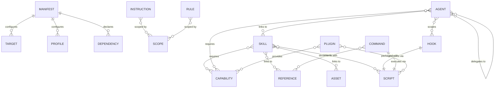

# GoAgentMeta Language Reference

GoAgentMeta is a compiler that takes a **canonical source tree** (`.ai/`) and emits native artifacts for multiple AI-agent ecosystems — Claude Code, Cursor, GitHub Copilot, and Codex. The `.ai/` tree is the source language; the generated output files are compiler output.

This document is the entry point for the language reference. It explains the entity taxonomy, the common metadata envelope, core semantics (scope, preservation, appliesTo), and the `.ai/` directory layout. Each entity type has its own syntax reference linked below.

---

## Contents

- [Source Tree Layout](#source-tree-layout)
- [Entity Taxonomy](#entity-taxonomy)
- [Common Envelope — ObjectMeta](#common-envelope--objectmeta)
- [Scope](#scope)
- [AppliesTo](#appliesto)
- [Preservation](#preservation)
- [Target Overrides](#target-overrides)
- [Pipeline Overview](#pipeline-overview)
- [Entity Relationships](#entity-relationships)
- [Syntax References](#syntax-references)
- [Examples](#examples)

---

## Source Tree Layout

Every project that uses goagentmeta contains a `.ai/` directory at the repository root. The compiler reads this tree as source input.

```
.ai/
├── manifest.yaml          # Build defaults, targets, profiles, compiler policy
├── instructions/          # Always-on guidance files (*.yaml or *.md)
├── rules/                 # Conditional/scoped policy files (*.yaml)
├── skills/                # Reusable workflow bundle definitions (*.yaml or SKILL.md)
├── agents/                # Specialized delegate definitions (*.yaml)
├── hooks/                 # Lifecycle automation definitions (*.yaml)
├── commands/              # User-invoked entry points (*.yaml)
├── capabilities/          # Abstract capability contracts (*.yaml)
├── plugins/               # Deployable extension packages (*.yaml)
├── references/            # Supplemental knowledge documents (*.md)
├── assets/                # Static files (templates, diagrams, prompt partials)
├── scripts/               # Executable artifacts for hooks/commands/plugins
├── profiles/              # Profile definitions (local-dev.yaml, ci.yaml, …)
└── targets/               # Target-specific override files
```

The compiler output is written to `.ai-build/{target}/{profile}/`.

---

## Entity Taxonomy

GoAgentMeta defines two classes of entities: **authoring primitives** (what you write to describe your AI-agent behavior) and **runtime delivery primitives** (what packages and supports that behavior at runtime).

### Authoring Primitives

| Kind | Purpose | Directory |
|---|---|---|
| **Instruction** | Always-on guidance: architecture principles, standards, policies | `.ai/instructions/` |
| **Rule** | Scoped or conditional policy: language-specific rules, security restrictions | `.ai/rules/` |
| **Skill** | Reusable workflow bundle: how to build a Lambda, review IAM, scaffold code | `.ai/skills/` |
| **Agent** | Specialized delegate: role prompt + tool policy + delegation + handoffs | `.ai/agents/` |
| **Hook** | Deterministic lifecycle automation triggered by events | `.ai/hooks/` |
| **Command** | Explicit user-invoked entry point (e.g., `/review-iam`) | `.ai/commands/` |

### Runtime Delivery Primitives

| Kind | Purpose | Directory |
|---|---|---|
| **Capability** | Abstract contract required by authoring primitives | `.ai/capabilities/` |
| **Plugin** | Deployable extension providing capabilities and MCP bindings | `.ai/plugins/` |
| **Reference** | Supplemental knowledge document demand-loaded by the AI | `.ai/references/` |
| **Asset** | Static file consumed by tooling or emitted into build output | `.ai/assets/` |
| **Script** | Executable artifact for hooks, commands, skills, or plugins | `.ai/scripts/` |

---

## Common Envelope — ObjectMeta

Every authoring primitive embeds an **ObjectMeta** envelope that carries identity, versioning, scoping, preservation semantics, inheritance, and the target override surface. All fields except `id` and `kind` are optional.

```yaml
id: my-object               # Unique identifier within the source tree (required)
kind: skill                 # Object kind (required) — instruction|rule|skill|agent|hook|command|capability|plugin
version: 1                  # Schema version integer (default: 1)
description: "…"            # Human-readable summary
packageVersion: "1.0.0"     # Semantic version when distributing this object as a package
license: MIT                # SPDX license identifier
owner: platform-team        # Team or individual responsible for this object
labels:                     # Arbitrary tags for grouping and selection
  - go
  - lambda
preservation: preferred     # required | preferred | optional  (see Preservation)
scope:                      # Where this object applies (see Scope)
  paths: ["services/**"]
  fileTypes: [".go"]
  labels: ["backend"]
appliesTo:                  # Which targets/profiles this object is active for
  targets: ["*"]
  profiles: ["local-dev", "ci"]
extends:                    # Inheritance: list of object IDs to inherit from
  - base-go-instruction
targetOverrides:            # Delta adjustments per target (see Target Overrides)
  cursor:
    enabled: false
```

### ObjectMeta Field Reference

| Field | Type | Default | Description |
|---|---|---|---|
| `id` | string | — | Unique object identifier in the source tree |
| `kind` | Kind | — | Object type: `instruction`, `rule`, `skill`, `agent`, `hook`, `command`, `capability`, `plugin` |
| `version` | int | `1` | Schema version for this object definition |
| `description` | string | `""` | Human-readable summary of this object's purpose |
| `packageVersion` | string | `""` | Semantic version for distributable packages (e.g., `"1.3.0"`) |
| `license` | string | `""` | SPDX license identifier (e.g., `MIT`, `Apache-2.0`) |
| `owner` | string | `""` | Team or individual responsible for maintaining this object |
| `labels` | []string | `[]` | Arbitrary tags for grouping, filtering, and scoped selection |
| `preservation` | Preservation | `preferred` | Lowering behavior when a target cannot support this object |
| `scope` | Scope | repo root | Where in the repository this object applies |
| `appliesTo` | AppliesTo | all targets/profiles | Which targets and profiles this object is active for |
| `extends` | []string | `[]` | Object IDs to inherit from (delta-based inheritance) |
| `targetOverrides` | map[target]TargetOverride | `{}` | Per-target syntax, placement, enablement, and extra adjustments |

---

## Scope

`Scope` controls **where** in the repository a canonical object applies. An object with no scope applies at the repository root (globally).

```yaml
scope:
  paths:                  # Filesystem paths or glob patterns
    - "services/**"
    - "cmd/api/**"
  fileTypes:              # File extension filter
    - ".go"
    - ".ts"
  labels:                 # Semantic tags (bounded-context or domain scoping)
    - backend
    - security-sensitive
```

| Field | Type | Description |
|---|---|---|
| `paths` | []string | Filesystem paths or glob patterns where this object applies. Empty = repository root. |
| `fileTypes` | []string | Restrict applicability to specific file extensions (e.g., `".go"`, `".ts"`). |
| `labels` | []string | Semantic tags; used for bounded-context or domain scoping. |

---

## AppliesTo

`AppliesTo` constrains which **compiler targets** and **build profiles** an object is active for. Use `["*"]` to mean all.

```yaml
appliesTo:
  targets:                # claude | cursor | copilot | codex | *
    - claude
    - copilot
  profiles:               # local-dev | ci | enterprise-locked | oss-public | *
    - local-dev
    - ci
```

| Field | Type | Default | Description |
|---|---|---|---|
| `targets` | []string | `["*"]` | Target ecosystem identifiers. `["*"]` means all configured targets. |
| `profiles` | []string | `["*"]` | Build profile identifiers. `["*"]` means all configured profiles. |

---

## Preservation

Every canonical object carries a `preservation` level that tells the compiler how to behave when a target does not natively support the concept.

| Level | Behavior |
|---|---|
| `required` | Unsupported or unsafe lowering **fails the build**. Use for critical security rules and policies. |
| `preferred` | Lower when safe; otherwise **warn and skip**. Use for most authoring primitives. |
| `optional` | May skip entirely; always **reports** what was skipped. Use for nice-to-have enhancements. |

---

## Target Overrides

`targetOverrides` lets you apply **delta adjustments** for a specific target without creating a separate object. Overrides may adjust syntax, file placement, enablement, or arbitrary extra key-value pairs. They must not silently redefine the canonical meaning of the object.

```yaml
targetOverrides:
  cursor:
    enabled: false          # Disable this object entirely for the cursor target
  copilot:
    syntax:
      format: prompt-file   # Target-specific syntax hint
    placement:
      directory: .github/copilot/instructions
    extra:
      priority: "high"
```

| Field | Type | Description |
|---|---|---|
| `enabled` | *bool | Override enablement for this target. `null` inherits from the base object. |
| `syntax` | map[string]string | Target-specific syntax adjustments (hints to the renderer). |
| `placement` | map[string]string | Target-specific file placement hints. |
| `extra` | map[string]string | Arbitrary target-native key-value pairs passed to the renderer. |

---

## Pipeline Overview

The compiler executes a fixed sequence of phases. Each phase reads one intermediate representation (IR) and produces the next.

```mermaid
flowchart LR
    A([".ai/ source tree"]) --> B[parse]
    B --> C[validate]
    C --> D[resolve]
    D --> E[normalize]
    E --> F[plan]
    F --> G[capability]
    G --> H[lower]
    H --> I[render]
    I --> J[materialize]
    J --> K[report]
    K --> L([".ai-build/ output"])

    style A fill:#e8f5e9,stroke:#388e3c
    style L fill:#e3f2fd,stroke:#1565c0
```



| Phase | Purpose |
|---|---|
| **parse** | Read `.ai/` files into raw objects |
| **validate** | Validate against schemas |
| **resolve** | Resolve external package dependencies |
| **normalize** | Build semantic graph with resolved inheritance |
| **plan** | Expand into target × profile build units |
| **capability** | Resolve capabilities and select providers |
| **lower** | Lower unsupported concepts per target |
| **render** | Emit target-native files |
| **materialize** | Write files to disk |
| **report** | Generate provenance and build report |

---

## Entity Relationships



---

## Syntax References

| Document | Entity |
|---|---|
| [syntax-manifest.md](syntax-manifest.md) | Manifest — build configuration and registry |
| [syntax-instruction.md](syntax-instruction.md) | Instruction — always-on guidance |
| [syntax-rule.md](syntax-rule.md) | Rule — scoped or conditional policy |
| [syntax-skill.md](syntax-skill.md) | Skill — reusable workflow bundle |
| [syntax-agent.md](syntax-agent.md) | Agent — specialized delegate |
| [syntax-hook.md](syntax-hook.md) | Hook — lifecycle automation |
| [syntax-command.md](syntax-command.md) | Command — user-invoked entry point |
| [syntax-capability.md](syntax-capability.md) | Capability — abstract contract |
| [syntax-plugin.md](syntax-plugin.md) | Plugin — deployable extension |
| [syntax-reference.md](syntax-reference.md) | Reference and Asset |
| [syntax-script.md](syntax-script.md) | Script — executable artifact |

---

## Examples

Progressive examples from beginner to advanced are in [`examples/`](examples/README.md).

| File | Level | Topic |
|---|---|---|
| [01-first-instruction.md](examples/01-first-instruction.md) | Beginner | First instruction |
| [02-scoped-rule.md](examples/02-scoped-rule.md) | Beginner | Scoped rule |
| [03-basic-skill.md](examples/03-basic-skill.md) | Beginner | Basic skill |
| [04-basic-agent.md](examples/04-basic-agent.md) | Intermediate | Agent with skill |
| [05-hooks-and-scripts.md](examples/05-hooks-and-scripts.md) | Intermediate | Hooks and scripts |
| [06-commands-and-references.md](examples/06-commands-and-references.md) | Intermediate | Commands and references |
| [07-agentmd-authoring.md](examples/07-agentmd-authoring.md) | Intermediate | Authoring AGENT.md |
| [08-plugin-mcp.md](examples/08-plugin-mcp.md) | Advanced | MCP plugin |
| [09-multi-agent-delegation.md](examples/09-multi-agent-delegation.md) | Advanced | Multi-agent delegation |
| [10-full-project.md](examples/10-full-project.md) | Advanced | Complete project |
