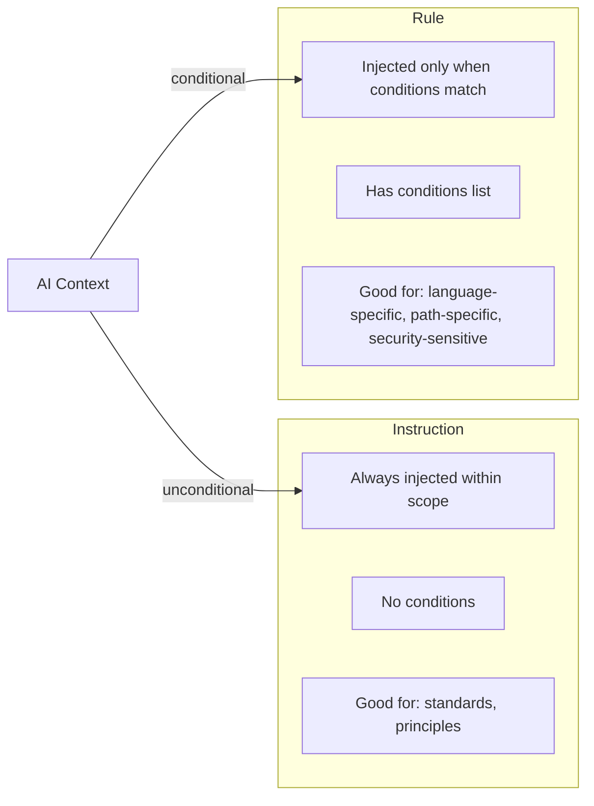

# Example 02: Scoped Rule

**Level**: 🟢 Beginner  
**Goal**: Create a rule that is conditionally activated for Go files in a security-sensitive path.

---

## What You'll Build

A rule that applies only to Go files under `services/auth/` and `services/payments/`, activated by a `language: go` condition. You will also see how rules differ from instructions.

---

## File Structure

```
my-repo/
└── .ai/
    ├── manifest.yaml
    └── rules/
        └── go-secrets-policy.md
```

---

## The Rule

<!-- .ai/rules/go-secrets-policy.md -->

```markdown
---
id: go-secrets-policy
kind: rule
description: Prevent credential exposure in security-sensitive Go services
preservation: required
scope:
  paths:
    - "services/auth/**"
    - "services/payments/**"
  fileTypes:
    - ".go"
conditions:
  - type: language
    value: go
  - type: path-pattern
    value: "services/{auth,payments}/**"
---

## Security Policy: Credentials and Secrets

These rules apply to all Go code in the auth and payments services.

### Forbidden Patterns
- Never use `fmt.Println`, `log.Printf`, or any logger to print variables
  that might contain tokens, passwords, API keys, or PII
- Never pass `*http.Request` bodies or form values to loggers
- Do not use `os.Getenv` for secrets — use the secrets manager client

### Required Patterns
- Use `crypto/rand` for all cryptographic randomness (never `math/rand`)
- Always validate JWT expiry and signature before trusting claims
- Use constant-time comparison (`subtle.ConstantTimeCompare`) for token equality

### Code Review Checklist
Before completing any change, verify:
1. No secrets appear in log output
2. All external inputs are validated before use
3. Errors do not leak internal state to external callers
```

---

## Instruction vs. Rule — Side by Side



---

## How Conditions Work

All conditions in the list must be satisfied (AND semantics):

```yaml
conditions:
  - type: language    # Must be Go
    value: go
  - type: path-pattern  # AND must be under services/auth or services/payments
    value: "services/{auth,payments}/**"
```

If you need OR semantics, create two separate rules and give them the same `labels` tag.

---

## Preservation: `required` vs. `preferred`

```yaml
# Use required when this policy MUST be present
preservation: required

# Use preferred when it's important but the build can succeed without it
preservation: preferred
```

For the secrets policy above, `preservation: required` means the build **fails** if the compiler cannot emit this rule for a target. Use this for compliance-critical policies.

---

## Target Lowering

Cursor does not natively support conditional rules. The compiler lowers this rule to a `.cursor/rules/go-secrets-policy.mdc` file with `globs` frontmatter:

```markdown
---
globs: ["services/auth/**/*.go", "services/payments/**/*.go"]
---
## Security Policy: Credentials and Secrets
...
```

The `conditions` beyond `language` and `path-pattern` are expressed as comments — not machine-enforced. This is why `preservation: required` would fail on Cursor unless the renderer supports it. To allow Cursor, use `preferred` or add a target override:

```yaml
targetOverrides:
  cursor:
    enabled: false   # Skip this rule on Cursor if Cursor team is not in scope
```

---

## Next Steps

- [03-basic-skill.md](03-basic-skill.md) — Build a reusable skill
- [../syntax-rule.md](../syntax-rule.md) — Full rule syntax reference
