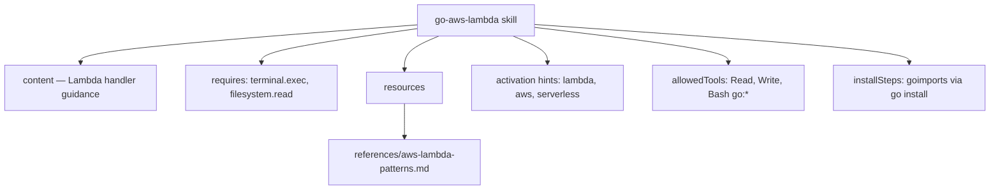

# Example 03: Basic Skill

**Level**: 🟢 Beginner  
**Goal**: Author a reusable skill for Go AWS Lambda development. Also shows the AgentSkills.io SKILL.md import format.

---

## What You'll Build

A skill named `go-aws-lambda` that the AI can invoke to guide Lambda development. You'll see:
- The canonical Markdown-with-frontmatter form for your `.ai/skills/` directory
- The AgentSkills.io SKILL.md form (used when importing community skills)
- How activation hints, allowed tools, and resources work

---

## File Structure

```
my-repo/
└── .ai/
    ├── manifest.yaml
    ├── skills/
    │   └── go-aws-lambda.md
    └── references/
        └── aws-lambda-patterns.md
```

---

## Canonical Form

```markdown
<!-- .ai/skills/go-aws-lambda.md -->
---
id: go-aws-lambda
kind: skill
description: Build, test, and deploy Go Lambda functions with AWS SDK v2
packageVersion: "1.0.0"
license: MIT
preservation: preferred
scope:
  paths:
    - "services/**"
labels:
  - go
  - aws
  - lambda
requires:
  - terminal.exec
  - filesystem.read
resources:
  references:
    - references/aws-lambda-patterns.md
activation:
  hints:
    - lambda
    - aws
    - serverless
    - api-gateway
allowedTools:
  - Read
  - Write
  - Edit
  - Glob
  - Grep
  - "Bash(go:*)"
  - "Bash(golangci-lint:*)"
  - "Bash(aws:*)"
userInvocable: true
compatibility: "Designed for Go projects deployed on AWS Lambda."
binaryDeps:
  - go
  - golangci-lint
installSteps:
  - kind: go
    package: golang.org/x/tools/cmd/goimports@latest
    bins: [goimports]
---

## Go AWS Lambda Skill

### Handler Pattern

Always use the context-first handler signature:

```go
func handler(ctx context.Context, event events.APIGatewayProxyRequest) (
    events.APIGatewayProxyResponse, error,
) {
    // propagate context to all downstream calls
}

func main() {
    lambda.Start(handler)
}
```

### Key Rules
- Use `github.com/aws/aws-lambda-go/lambda` and `events` packages
- Use AWS SDK v2: `github.com/aws/aws-sdk-go-v2`
- Load config with `config.LoadDefaultConfig(ctx)` — never hardcode region
- Return `(events.APIGatewayProxyResponse, error)` — never call `os.Exit`
- Wrap SDK errors: `fmt.Errorf("dynamodb.GetItem: %w", err)`

### Testing
- Unit-test the handler with table-driven tests
- Use `aws.String`, `aws.Int64` helpers for pointer values
- Mock AWS clients with interfaces — never call real AWS in unit tests

For in-depth patterns, consult `references/aws-lambda-patterns.md`.
```

---

## AgentSkills.io SKILL.md Import Format

Place this file in `.agents/skills/go-aws-lambda/SKILL.md` to use the community import format:

```markdown
---
name: go-aws-lambda
description: "Build, test, and deploy Go Lambda functions with AWS SDK v2."
user-invocable: true
license: MIT
compatibility: Designed for Go projects deployed on AWS Lambda.
metadata:
  author: my-team
  version: "1.0.0"
  openclaw:
    emoji: "🚀"
    homepage: https://github.com/my-org/go-lambda-skill
    requires:
      bins:
        - go
        - golangci-lint
    install:
      - kind: go
        package: golang.org/x/tools/cmd/goimports@latest
        bins: [goimports]
allowed-tools: Read Write Edit Glob Grep Bash(go:*) Bash(golangci-lint:*) Bash(aws:*)
---

## Go AWS Lambda Skill

### Handler Pattern

Always use the context-first handler signature:

```go
func handler(ctx context.Context, event events.APIGatewayProxyRequest) (
    events.APIGatewayProxyResponse, error,
) {
    // propagate context to all downstream calls
}
```

### Key Rules
- Use AWS SDK v2: `github.com/aws/aws-sdk-go-v2`
- Never hardcode region or credentials
- Return proper responses — never call `os.Exit`
```

---

## Skill Composition



---

## Reference File

Create the on-demand reference the skill points to:

```markdown
<!-- .ai/references/aws-lambda-patterns.md -->

# AWS Lambda Patterns for Go

## Cold Start Optimization

- Initialize AWS clients outside the handler (package-level `var`)
- Use `sync.Once` for lazy initialization of heavy resources

## Error Responses

Always return structured JSON error responses:

```go
return events.APIGatewayProxyResponse{
    StatusCode: http.StatusBadRequest,
    Body:       `{"error":"invalid request"}`,
    Headers:    map[string]string{"Content-Type": "application/json"},
}, nil
```

## Structured Logging

Use `log/slog` with Lambda request ID in context:

```go
slog.InfoContext(ctx, "processing request", "requestId", request.RequestContext.RequestID)
```
```

---

## Key Points

- **`userInvocable: true`** — Enables `/go-aws-lambda` as a slash command on Claude Code and Copilot
- **`activation.hints`** — The AI auto-loads this skill when it detects keywords like "lambda" or "api-gateway" in the conversation
- **`allowedTools`** — Restricts which tools this skill can use; `"Bash(go:*)"` allows any `go` subcommand
- **`resources.references`** — Points at in-depth docs the AI reads on demand (not always loaded)

---

## Next Steps

- [04-basic-agent.md](04-basic-agent.md) — Link this skill to a specialized agent
- [../syntax-skill.md](../syntax-skill.md) — Full skill syntax reference
