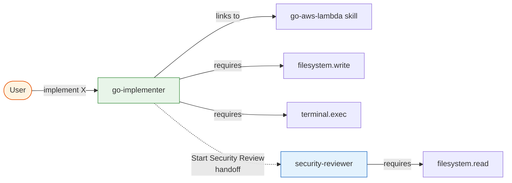
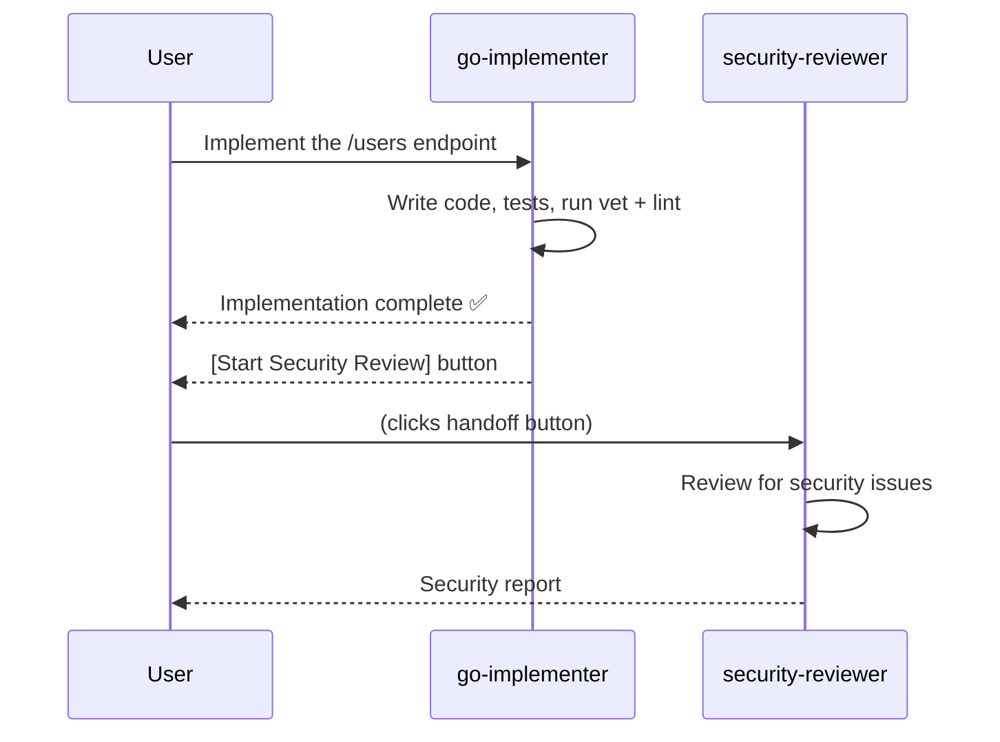

# Example 04: Basic Agent

**Level**: 🟡 Intermediate  
**Goal**: Create a specialized Go implementer agent that links to the skill from example 03 and enforces a strict tool policy.

---

## What You'll Build

A `go-implementer` agent with:
- A focused role prompt
- A link to the `go-aws-lambda` skill
- A tool policy that allows writes but denies network access
- A handoff to a security reviewer

---

## File Structure

```
my-repo/
└── .ai/
    ├── manifest.yaml
    ├── skills/
    │   └── go-aws-lambda.md      # from example 03
    └── agents/
        ├── go-implementer.md
        └── security-reviewer.md
```

---

## The Implementer Agent

```markdown
<!-- .ai/agents/go-implementer.md -->
---
id: go-implementer
kind: agent
description: Implement Go services with tests, following project conventions
preservation: preferred

skills:
  - go-aws-lambda

requires:
  - filesystem.read
  - filesystem.write
  - terminal.exec
  - repo.search

tools:
  - Read
  - Edit
  - Bash
disallowedTools:
  - WebFetch                  # No direct network access

handoffs:
  - label: Start Security Review
    agent: security-reviewer
    prompt: |
      Review the implementation I just completed for security issues.
      Pay attention to:
      - Input validation and sanitization
      - Error handling that might leak internal state
      - Any credential or secret handling
    autoSend: false           # User confirms before sending
---

You are a Go implementation specialist for this project.

Your responsibilities:
- Implement features and bug fixes in Go following hexagonal architecture
- Write table-driven tests for every exported function
- Run `go vet ./...` and `golangci-lint run` before reporting completion
- Document exported types and functions with Go doc comments

Constraints:
- Produce minimal, correct changes — do not refactor unrelated code
- Do not make network calls except through the project's declared interfaces
- If you are unsure about a security implication, use the "Start Security Review" handoff
```

---

## The Security Reviewer Agent

```markdown
<!-- .ai/agents/security-reviewer.md -->
---
id: security-reviewer
kind: agent
description: Security-focused review of Go code changes
preservation: preferred

requires:
  - filesystem.read
  - repo.search

tools:
  - Read
disallowedTools:
  - Write                     # Reviewer does not modify code
  - Edit
  - Bash
---

You are a security reviewer specializing in Go microservices.

For each review:
1. Check for credential/secret exposure in logs or error messages
2. Verify all external inputs are validated before use
3. Check that cryptographic operations use approved algorithms
4. Verify error responses do not leak internal implementation details
5. Confirm proper use of context cancellation and timeouts

Output a structured report:
- **Critical** findings (must fix before merge)
- **Warning** findings (should fix, explain risk)
- **Info** findings (optional improvements)
```

---

## Agent Relationships



---

## How the Handoff Works

When the implementer finishes its task, it presents a "Start Security Review" button to the user. The user clicks it and the conversation transitions to the `security-reviewer` agent with the pre-filled prompt.



---

## Tool Policy Details

The `tools` and `disallowedTools` lists control access at the tool level:

```yaml
tools:
  - Edit                      # ✅ Can edit files
disallowedTools:
  - WebFetch                  # ❌ Cannot make HTTP calls
```

Skills and agents share the same tool model — both use `tools` (allowed) and `disallowedTools` (denied).

---

## Key Points

- **`skills`** — The agent has access to all skills listed; it decides when to invoke them based on the task
- **`rolePrompt`** — Write it as an imperative system prompt; include both responsibilities and constraints
- **`tools` / `disallowedTools`** — Use `tools` for concrete tool names that should be allowed; `disallowedTools` for tools that should never be used
- **`handoffs`** — A guided workflow transition; `autoSend: false` means the user controls when it triggers

---

## Next Steps

- [05-hooks-and-scripts.md](05-hooks-and-scripts.md) — Add a post-edit validation hook
- [09-multi-agent-delegation.md](09-multi-agent-delegation.md) — Advanced multi-agent delegation
- [../syntax-agent.md](../syntax-agent.md) — Full agent syntax reference
