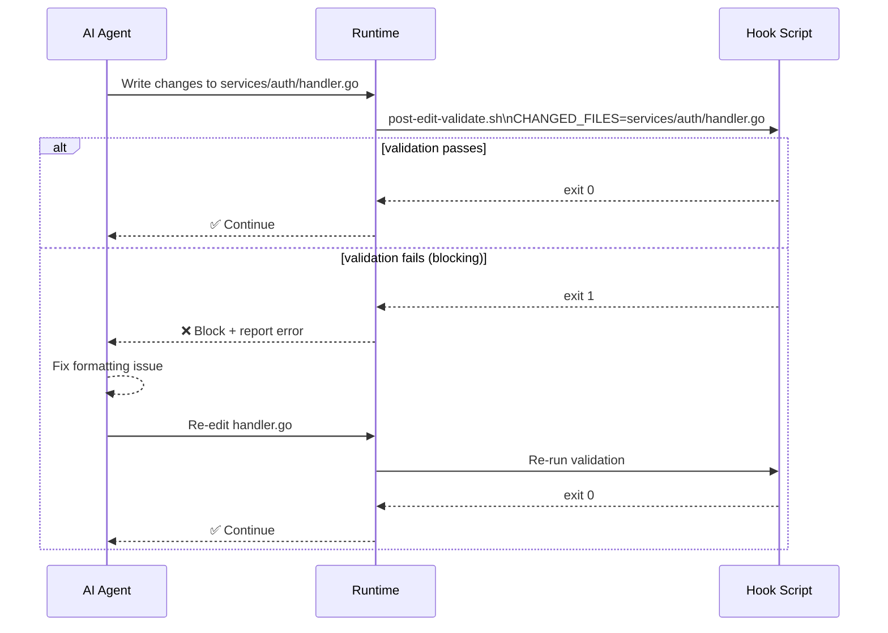

# Example 05: Hooks and Scripts

**Level**: 🟡 Intermediate  
**Goal**: Create a `post-edit` hook that validates changed Go files using a bash script, and a `session-start` hook that sets up the workspace.

---

## What You'll Build

Two hooks:
1. **`post-edit-validate`** — runs `gofmt` and `go vet` after every file edit (blocking)
2. **`session-start-setup`** — installs tool dependencies at session start (advisory)

Plus the bash scripts that back them.

---

## File Structure

```
my-repo/
└── .ai/
    ├── manifest.yaml
    ├── hooks/
    │   ├── post-edit-validate.yaml
    │   └── session-start-setup.yaml
    └── scripts/
        └── hooks/
            ├── post-edit-validate.sh
            └── session-start-setup.sh
```

---

## Hook 1: Post-Edit Validation

```yaml
# .ai/hooks/post-edit-validate.yaml
id: post-edit-validate
kind: hook
description: Validate Go files immediately after every AI edit
preservation: preferred
scope:
  fileTypes:
    - ".go"

event: post-edit

action:
  type: script
  ref: scripts/hooks/post-edit-validate.sh

effect:
  class: validating
  enforcement: blocking       # Stop the workflow if validation fails

inputs:
  include:
    - changedFiles
    - workingDirectory

policy:
  timeoutSeconds: 30
  maxRetries: 0
  failurePolicy: fail-build
```

```bash
#!/usr/bin/env bash
# .ai/scripts/hooks/post-edit-validate.sh
# Validates changed Go files: gofmt + go vet.
# Called after each AI edit. CHANGED_FILES contains space-separated paths.

set -euo pipefail

if [ -z "${CHANGED_FILES:-}" ]; then
  echo "No changed files — skipping validation."
  exit 0
fi

FAILED=0

for file in $CHANGED_FILES; do
  [[ "$file" != *.go ]] && continue

  echo "Checking: $file"

  # gofmt check
  if ! gofmt -l "$file" | grep -q .; then
    : # file is formatted correctly
  else
    echo "  ❌ gofmt: $file is not formatted"
    FAILED=1
  fi

  # go vet (on the containing package)
  pkg_dir="$(dirname "$file")"
  if ! go vet "./$pkg_dir/..." 2>&1; then
    echo "  ❌ go vet failed for $pkg_dir"
    FAILED=1
  fi
done

if [ "$FAILED" -eq 1 ]; then
  echo ""
  echo "Validation failed. Run 'gofmt -w . && go vet ./...' to fix."
  exit 1
fi

echo "✅ Validation passed."
exit 0
```

---

## Hook 2: Session Start Setup

```yaml
# .ai/hooks/session-start-setup.yaml
id: session-start-setup
kind: hook
description: Install required Go tools at session start
preservation: optional          # Nice to have — skip silently if unsupported

event: session-start

action:
  type: script
  ref: scripts/hooks/session-start-setup.sh

effect:
  class: setup
  enforcement: advisory         # Warn if it fails, but don't block the session

inputs:
  include:
    - workingDirectory

policy:
  timeoutSeconds: 120           # Installing tools can take time
  maxRetries: 1
  failurePolicy: warn
```

```bash
#!/usr/bin/env bash
# .ai/scripts/hooks/session-start-setup.sh
# Installs required Go tooling if not already present.

set -euo pipefail

install_if_missing() {
  local bin="$1"
  local pkg="$2"
  if ! command -v "$bin" &>/dev/null; then
    echo "Installing $bin..."
    go install "$pkg"
  else
    echo "✅ $bin already installed."
  fi
}

install_if_missing goimports golang.org/x/tools/cmd/goimports@latest
install_if_missing golangci-lint github.com/golangci/golangci-lint/cmd/golangci-lint@latest
install_if_missing benchstat golang.org/x/perf/cmd/benchstat@latest

echo "Setup complete."
exit 0
```

---

## Hook Lifecycle



---

## Effect × Enforcement Choices

For the validation hook, we use `blocking` because a Go file with formatting errors should not be left in that state:

```yaml
effect:
  class: validating
  enforcement: blocking   # Stop workflow on failure
```

For the setup hook, we use `advisory` because tool installation is helpful but not mandatory for the AI to function:

```yaml
effect:
  class: setup
  enforcement: advisory   # Warn but continue
```

---

## Scoping a Hook to an Agent

To limit this hook to only run when the `go-implementer` agent is active, add it to the agent's `hooks` list:

```yaml
# .ai/agents/go-implementer.yaml
hooks:
  - post-edit-validate
  - session-start-setup
```

Without this, the hook applies globally to all AI sessions.

---

## Key Points

- **`scope.fileTypes: [".go"]`** — The hook only triggers when a `.go` file is in `CHANGED_FILES`
- **`enforcement: blocking`** — The workflow pauses until the hook exits 0; use for correctness checks
- **`enforcement: advisory`** — The workflow continues regardless; use for setup and reporting
- **`inputs.include: [changedFiles]`** — Tells the runtime to pass changed file paths as `$CHANGED_FILES`
- **`policy.timeoutSeconds`** — Always set a reasonable timeout; setup hooks may need more time

---

## Next Steps

- [06-commands-and-references.md](06-commands-and-references.md) — Add a user-invocable command
- [../syntax-hook.md](../syntax-hook.md) — Full hook syntax reference
- [../syntax-script.md](../syntax-script.md) — Full script syntax reference
