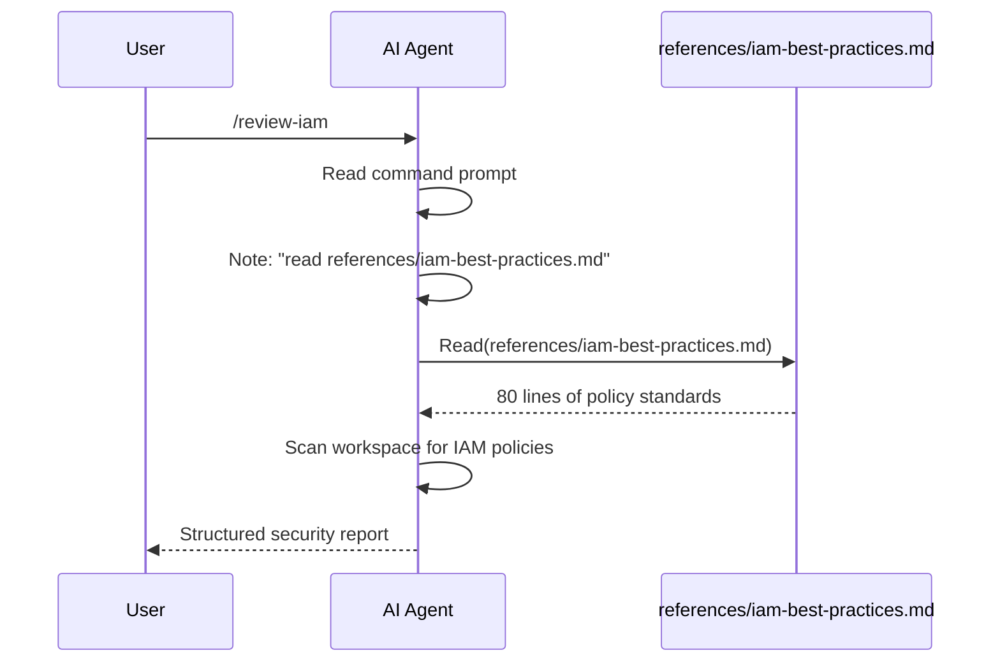

# Example 06: Commands and References

**Level**: 🟡 Intermediate  
**Goal**: Create a `/review-iam` command that guides the AI through a security review, backed by a detailed reference document loaded on demand.

---

## What You'll Build

- A `review-iam` command that users invoke with `/review-iam`
- A reference document (`iam-best-practices.md`) with the full IAM policy standard
- A second command (`scaffold-service`) that uses a prompt action

---

## File Structure

```
my-repo/
└── .ai/
    ├── manifest.yaml
    ├── commands/
    │   ├── review-iam.yaml
    │   └── scaffold-service.yaml
    └── references/
        └── iam-best-practices.md
```

---

## Command 1: IAM Review

```yaml
# .ai/commands/review-iam.yaml
id: review-iam
kind: command
description: Review all IAM policies in the workspace for security issues
preservation: preferred

action:
  type: prompt
  ref: |
    You are an AWS IAM security reviewer.

    First, read `references/iam-best-practices.md` for the full policy standard
    and required/forbidden patterns. This document contains the authoritative
    policy requirements for this project.

    Then:
    1. Find all IAM policy documents in the current workspace
       (look in terraform/, cdk/, cloudformation/, and *.json files with "Statement" keys)
    2. For each policy, evaluate it against the standard
    3. Report findings in this format:

    ---
    **File**: path/to/policy.json
    **Resource**: arn:aws:... (or "*")
    **Finding**: [Critical|Warning|Info] — short description
    **Detail**: explanation and recommendation
    ---

    Focus on: over-permissive wildcards, missing conditions, privilege escalation paths,
    and missing resource constraints.
```

---

## Reference Document

```markdown
<!-- .ai/references/iam-best-practices.md -->

# AWS IAM Best Practices

This is the authoritative IAM policy standard for this project.
The AI reads this document on demand when running the `/review-iam` command.

## Least-Privilege Principles

### Forbidden Patterns

1. **Action wildcards on sensitive services**
   ```json
   // FORBIDDEN
   { "Action": "s3:*", "Resource": "*" }
   // REQUIRED
   { "Action": ["s3:GetObject", "s3:PutObject"], "Resource": "arn:aws:s3:::my-bucket/*" }
   ```

2. **Missing MFA condition for sensitive operations**
   ```json
   // REQUIRED for IAM mutations and billing access
   "Condition": { "Bool": { "aws:MultiFactorAuthPresent": "true" } }
   ```

3. **Overly broad resource ARNs**
   Always use the most specific ARN possible. Never use `"*"` as the resource
   for DynamoDB, S3, Secrets Manager, or KMS.

## Required Conditions

| Service | Required Condition |
|---|---|
| S3 buckets | `aws:RequestedRegion` must match the deployment region |
| IAM mutations | `aws:MultiFactorAuthPresent: true` |
| KMS decryption | `kms:ViaService` must be the consuming service ARN |
| Assume Role | `sts:ExternalId` required for cross-account roles |

## Privilege Escalation Paths to Check

The following action combinations create privilege escalation paths:
- `iam:CreateAccessKey` + `iam:ListUsers`
- `iam:AttachUserPolicy` or `iam:PutUserPolicy`
- `iam:PassRole` + `ec2:RunInstances`
- `lambda:UpdateFunctionCode` + `iam:PassRole`

Any policy granting these combinations without a restricted condition is **Critical**.

## Severity Definitions

| Severity | Criteria |
|---|---|
| **Critical** | Privilege escalation path, admin wildcard, or missing MFA on sensitive ops |
| **Warning** | Overly broad resource scope, missing recommended conditions |
| **Info** | Style issues, outdated patterns, documentation opportunities |
```

---

## Command 2: Scaffold Service

A command with an inline prompt that guides the AI through creating a new service:

```yaml
# .ai/commands/scaffold-service.yaml
id: scaffold-service
kind: command
description: Scaffold a new Go microservice with hexagonal architecture
preservation: preferred

action:
  type: prompt
  ref: |
    You are scaffolding a new Go microservice for this project.

    Ask me for:
    1. Service name (kebab-case, e.g., "user-profile")
    2. Whether it needs a database (DynamoDB, PostgreSQL, or none)
    3. Whether it exposes an HTTP API (yes/no)

    Then create the full directory structure:

    {service-name}/
    ├── internal/
    │   ├── domain/           # Pure domain entities and value objects
    │   ├── application/      # Use cases and orchestration
    │   ├── port/             # Port interfaces
    │   └── adapter/          # Infrastructure implementations
    ├── cmd/
    │   └── {service-name}/
    │       └── main.go
    ├── go.mod
    └── README.md

    Follow the project's hexagonal architecture conventions.
    Create go.mod with the correct module path based on the repo root.
```

---

## How the Reference is Demand-Loaded



The reference is only loaded when the command is invoked — it is not part of the always-on context. This keeps the AI context lean for sessions that don't need IAM review knowledge.

---

## Target Mapping

| Target | `/review-iam` surface |
|---|---|
| Claude Code | Slash command `/review-iam` |
| GitHub Copilot | Prompt file in `.github/copilot/` — selectable in chat panel |
| Cursor | Lowered to a context note; no native slash command |
| Codex | Agent command `/review-iam` |

---

## Key Points

- **`action.type: prompt`** — The command body is the prompt sent to the AI when invoked
- **Reference demand-loading** — The prompt explicitly tells the AI to `Read` the reference file; this is intentional — the AI decides when it needs the document
- **`action.type: skill`** — Alternatively, point to a skill ID to use a skill as the command body
- **Commands are invocable** — Unlike skills (which can be auto-loaded), commands require explicit user invocation

---

## Next Steps

- [07-agentmd-authoring.md](07-agentmd-authoring.md) — How to author an AGENT.md
- [../syntax-command.md](../syntax-command.md) — Full command syntax reference
- [../syntax-reference.md](../syntax-reference.md) — Reference and asset syntax
