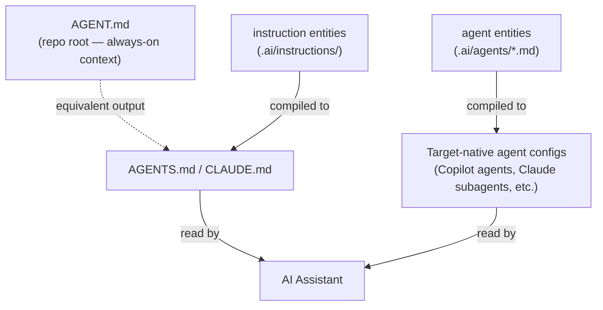

# Example 07: Authoring AGENT.md

**Level**: 🟡 Intermediate  
**Goal**: Understand how AGENT.md files work, how to author them manually, and how goagentmeta generates them automatically from agent definitions.

---

## Two Kinds of AGENT.md

There are two related but distinct concepts:

| Concept | What it is | How it's created |
|---|---|---|
| **AGENT.md (repo instructions)** | A Markdown file at the repo root that AI assistants (Codex, Claude Code) read as always-on instructions | Written manually or generated from `instruction` entities |
| **Agent YAML entity** | A `.ai/agents/*.md` definition (Markdown with YAML frontmatter) of a specialized AI agent role | Authored as `.md` with YAML frontmatter in `.ai/agents/`, compiled to target-native output |

This example covers both. The goagentmeta project's own [`AGENT.md`](../../../AGENT.md) is an example of the first kind.

---

## Part 1: Authoring AGENT.md Manually

An `AGENT.md` file lives at your repository root and is read by AI assistants as always-on context. It describes the project's purpose, architecture, conventions, and available commands.

### Structure

```markdown
# My Service — Agent Guidelines

Brief description of what the project does and its purpose.

**Purpose**: One sentence describing the project.

## Architecture & Design Principles

- **Key principle 1** — brief explanation
- **Key principle 2** — brief explanation

## Technology Stack

| Category | Technology |
|----------|------------|
| Language | Go 1.25+ |
| Architecture | Hexagonal + DDD |

## Project Structure

```
project/
├── cmd/               # CLI entry points
├── internal/          # Private application code
│   ├── domain/        # Core domain model
│   ├── application/   # Use cases
│   ├── port/          # Port interfaces
│   └── adapter/       # Infrastructure
└── pkg/               # Public API
```

## Build Commands

```bash
make build         # Build the project
make test          # Run unit tests
make lint          # Run linter
make check         # build + lint + test
```

## Development Standards

- **Code quality**: Always run `make check` before reporting work complete
- **Testing**: Table-driven tests for all exported functions
- **Errors**: Wrap with `fmt.Errorf("context: %w", err)`

## Domain Concepts

| Concept | Definition |
|---------|------------|
| **Instruction** | Always-on guidance injected into AI context |
| **Skill** | Reusable workflow bundle |
| **Agent** | Specialized delegate with role and tool policy |
```

### Key Sections

| Section | Purpose |
|---|---|
| Header + purpose | Quick orientation for the AI |
| Architecture principles | Design constraints the AI must respect |
| Project structure | Helps the AI navigate the codebase |
| Build commands | Verified commands the AI can run |
| Domain vocabulary | Ubiquitous language the AI should use |
| Standards | Behavioral constraints and conventions |

---

## Part 2: Generating AGENT.md from goagentmeta

Instead of (or in addition to) writing AGENT.md manually, you can use `instruction` entities that the compiler compiles to `AGENTS.md` (Codex) and `CLAUDE.md` (Claude Code).

<!-- .ai/instructions/project-overview.md -->

```markdown
---
id: project-overview
kind: instruction
description: Project overview and architecture principles
preservation: required
---

# My Service — Agent Guidelines

A Go microservice for processing payment transactions.

## Architecture
- Hexagonal architecture: domain → application → port → adapter
- Go 1.25+, AWS SDK v2, DynamoDB

## Build Commands

```bash
make build   # Build
make test    # Test (with race detection)
make lint    # Lint
```

## Standards
- Table-driven tests for all exported functions
- Wrap errors: `fmt.Errorf("context: %w", err)`
- No `init()` functions in production code
```

When compiled for `codex` target, this instruction is emitted as `AGENTS.md`. For `claude`, it becomes `CLAUDE.md`.

---

## Part 3: AGENT.md + Agent YAML Together

The `AGENT.md` provides always-on context for the AI. The agent entities define **specialized roles** within that context.



### When to Write AGENT.md Manually

- Small projects or quick setup — just write one file
- You want full control over the exact output without a compilation step
- You are not using goagentmeta's multi-target compilation

### When to Use goagentmeta Instructions

- Multi-target deployments (Claude Code + Copilot + Cursor + Codex)
- Large teams where different instructions apply to different paths or profiles
- When you want inheritance, scope control, and preservation semantics

---

## Part 4: Effective AGENT.md Writing

### Do

- **Keep it focused** — the AI reads this on every session; every line costs context tokens
- **Include build commands** — verified commands the AI can run safely
- **Define domain vocabulary** — consistent terminology prevents misunderstandings
- **List available skills and agents** — help the AI know what tools it has
- **Document test and linting commands** — the AI should verify its work

### Don't

- **Don't describe obvious things** — assume the AI understands Go, git, etc.
- **Don't duplicate information** — one source of truth per concept
- **Don't make it a tutorial** — write for a capable developer, not a beginner

### Length

Aim for 200–500 lines. The goagentmeta project's own AGENT.md is a good reference for a comprehensive but focused example.

---

## Next Steps

- [08-plugin-mcp.md](08-plugin-mcp.md) — Add an MCP plugin for GitHub API access
- [../syntax-instruction.md](../syntax-instruction.md) — Instruction syntax (for generating AGENT.md)
- [../syntax-agent.md](../syntax-agent.md) — Agent entity syntax
