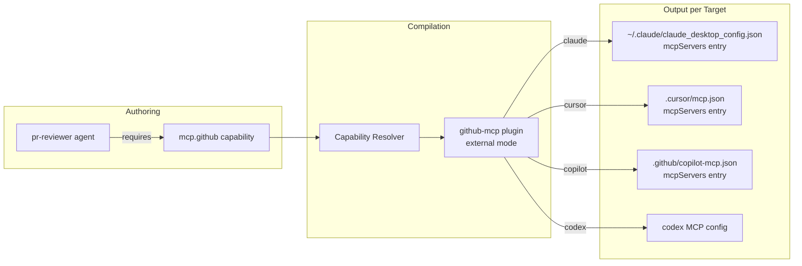

# Example 08: Plugin — External MCP Server

**Level**: 🔴 Advanced  
**Goal**: Wire up the GitHub MCP server as an external plugin, define a `mcp.github` capability, and link it from an agent that performs code review.

---

## What You'll Build

- A `mcp.github` capability definition
- An external plugin referencing `@modelcontextprotocol/server-github`
- Per-target install configuration (Claude, Cursor, Copilot, Codex)
- An agent that requires `mcp.github` to perform automated PR reviews

---

## File Structure

```
my-repo/
└── .ai/
    ├── manifest.yaml
    ├── capabilities/
    │   └── mcp-github.yaml
    ├── plugins/
    │   └── github-mcp.yaml
    └── agents/
        └── pr-reviewer.yaml
```

---

## Step 1: Define the Capability

```yaml
# .ai/capabilities/mcp-github.yaml
id: mcp.github
kind: capability
description: GitHub API access — issues, PRs, code, commits, and repository management

contract:
  category: mcp
  description: >
    Provides full GitHub API access through the Model Context Protocol.
    Supports reading and writing issues, pull requests, file contents,
    commits, branches, and repository metadata.

security:
  network: outbound     # Requires outbound HTTPS to api.github.com
  filesystem: none
```

---

## Step 2: Define the Plugin

```yaml
# .ai/plugins/github-mcp.yaml
id: github-mcp
kind: plugin
description: GitHub API access through the official MCP server
preservation: preferred

metadata:
  name: GitHub MCP Server

distribution:
  mode: external
  ref: "@modelcontextprotocol/server-github"

provides:
  capabilities:
    - mcp.github

security:
  trust: verified-publisher
  permissions:
    network: outbound
    secrets:
      - GITHUB_TOKEN        # Must be set in environment

targets:
  claude:
    install:
      kind: mcp-server-ref
      command: npx
      args:
        - "-y"
        - "@modelcontextprotocol/server-github"
      env:
        GITHUB_TOKEN: "${GITHUB_TOKEN}"

  cursor:
    install:
      kind: mcp-server-ref
      command: npx
      args:
        - "-y"
        - "@modelcontextprotocol/server-github"
      env:
        GITHUB_TOKEN: "${GITHUB_TOKEN}"

  copilot:
    install:
      kind: mcp-server-ref
      command: npx
      args:
        - "-y"
        - "@modelcontextprotocol/server-github"
      env:
        GITHUB_TOKEN: "${GITHUB_TOKEN}"

  codex:
    install:
      kind: mcp-server-ref
      command: npx
      args:
        - "-y"
        - "@modelcontextprotocol/server-github"
      env:
        GITHUB_TOKEN: "${GITHUB_TOKEN}"
```

---

## Step 3: Define the Agent

```yaml
# .ai/agents/pr-reviewer.yaml
id: pr-reviewer
kind: agent
description: Automated pull request reviewer using GitHub API
preservation: preferred

rolePrompt: |
  You are an automated pull request reviewer for this Go project.

  For each review:
  1. Use the GitHub MCP to read the PR diff and changed files
  2. Check each change against the project's coding standards
  3. Look for: missing tests, error handling gaps, style violations, security issues
  4. Post review comments directly to the PR via the GitHub MCP

  Review format for each file:
  - List issues as inline comments on specific line numbers
  - Summarize overall assessment at the end: APPROVE / REQUEST_CHANGES / COMMENT

  Focus on correctness and security — do not nitpick style.

skills:
  - go-aws-lambda           # domain knowledge for Lambda changes

requires:
  - mcp.github              # GitHub API access
  - filesystem.read         # Read local context if needed

toolPolicy:
  mcp.github: allow
  filesystem.read: allow
  filesystem.write: deny    # Reviewer does not modify local files
  terminal.exec: deny
```

---

## Capability → Plugin → Agent Chain



---

## Build Output Examples

### Claude Code Output

```json
// .ai-build/claude/local-dev/claude_desktop_config.json
{
  "mcpServers": {
    "github": {
      "command": "npx",
      "args": ["-y", "@modelcontextprotocol/server-github"],
      "env": {
        "GITHUB_TOKEN": "${GITHUB_TOKEN}"
      }
    }
  }
}
```

### Cursor Output

```json
// .ai-build/cursor/local-dev/.cursor/mcp.json
{
  "mcpServers": {
    "github": {
      "command": "npx",
      "args": ["-y", "@modelcontextprotocol/server-github"],
      "env": {
        "GITHUB_TOKEN": "${GITHUB_TOKEN}"
      }
    }
  }
}
```

---

## Security Considerations

### `GITHUB_TOKEN` Scope

The `GITHUB_TOKEN` needs only the minimum required permissions for your use case:

| Use Case | Required Scopes |
|---|---|
| Read PRs and issues | `repo:read` |
| Post review comments | `repo` (read + write) |
| Read public repos only | No token needed (rate limited) |

### Trust Level

`trust: verified-publisher` is appropriate for official MCP servers from Anthropic or well-known publishers. For internal or unknown plugins, use `trust: review-required`.

---

## Adding a Second MCP Plugin

To add a second plugin (e.g., Jira), follow the same pattern:

```yaml
# .ai/capabilities/mcp-jira.yaml
id: mcp.jira
kind: capability
contract:
  category: mcp
  description: Jira issue tracking API access
security:
  network: outbound
  filesystem: none
```

```yaml
# .ai/plugins/jira-mcp.yaml
id: jira-mcp
kind: plugin
distribution:
  mode: external
  ref: "@modelcontextprotocol/server-jira"
provides:
  capabilities:
    - mcp.jira
security:
  trust: verified-publisher
  permissions:
    network: outbound
    secrets:
      - JIRA_TOKEN
      - JIRA_BASE_URL
targets:
  claude:
    install:
      kind: mcp-server-ref
      command: npx
      args: ["-y", "@modelcontextprotocol/server-jira"]
      env:
        JIRA_TOKEN: "${JIRA_TOKEN}"
        JIRA_BASE_URL: "${JIRA_BASE_URL}"
```

---

## Next Steps

- [09-multi-agent-delegation.md](09-multi-agent-delegation.md) — Multi-agent delegation
- [../syntax-plugin.md](../syntax-plugin.md) — Full plugin syntax reference
- [../syntax-capability.md](../syntax-capability.md) — Full capability reference
