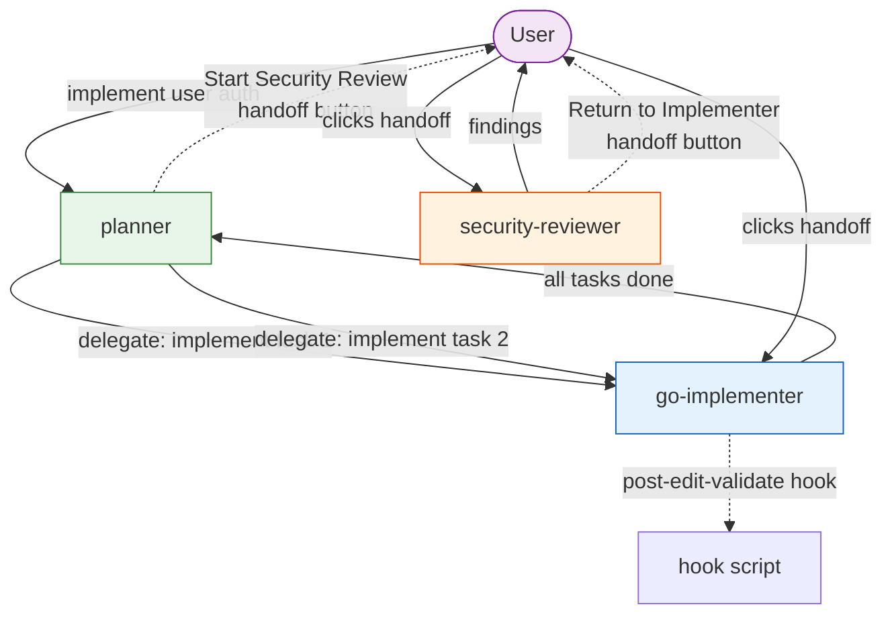
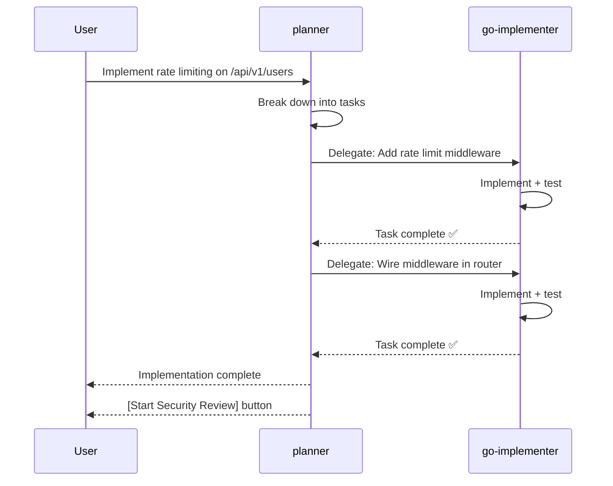

# Example 09: Multi-Agent Delegation

**Level**: 🔴 Advanced  
**Goal**: Build a three-agent system where a planner agent orchestrates an implementer and a reviewer via delegation and handoffs.

---

## What You'll Build

Three specialized agents:
1. **`planner`** — breaks down tasks and delegates to specialist agents
2. **`go-implementer`** — writes code, tests, and runs validation
3. **`security-reviewer`** — reviews changes for security issues

With:
- Delegation (programmatic subagent calls from planner → implementer)
- Handoffs (guided user-triggered transitions: implementer → reviewer)
- Scoped skills for each agent

---

## File Structure

```
my-repo/
└── .ai/
    ├── manifest.yaml
    ├── skills/
    │   ├── go-aws-lambda.yaml
    │   └── task-breakdown.yaml
    └── agents/
        ├── planner.yaml
        ├── go-implementer.yaml
        └── security-reviewer.yaml
```

---

## The Planner Agent

```yaml
# .ai/agents/planner.yaml
id: planner
kind: agent
description: Task planner that breaks down features and orchestrates specialist agents
preservation: preferred

rolePrompt: |
  You are a task planner for this Go microservice project.

  When given a feature request or bug report:
  1. Break it down into concrete, atomic implementation tasks
  2. Identify which tasks require code changes (delegate to go-implementer)
  3. Sequence tasks to minimize conflicts and merge issues
  4. After implementation is complete, initiate a security review for any
     changes touching authentication, authorization, or external inputs

  Output format for task breakdown:
  - **Task N**: [verb] [what] — brief description
    - Affected files: list
    - Dependencies: task numbers this depends on

  Then delegate each implementation task to `go-implementer` in order.

skills:
  - task-breakdown

requires:
  - filesystem.read
  - repo.search

toolPolicy:
  filesystem.read: allow
  repo.search: allow
  filesystem.write: deny    # Planner does not write code directly
  terminal.exec: deny

delegation:
  mayCall:
    - go-implementer        # Planner can delegate to implementer

handoffs:
  - label: Start Security Review
    agent: security-reviewer
    prompt: |
      Review all changes made during this session for security vulnerabilities.
      Focus on: input validation, credential handling, authorization checks,
      and error messages that might leak internal state.
    autoSend: false
```

---

## The Implementer Agent

```yaml
# .ai/agents/go-implementer.yaml
id: go-implementer
kind: agent
description: Go implementation specialist — writes code, tests, and validates
preservation: preferred

rolePrompt: |
  You are a Go implementation specialist.

  For each task delegated to you:
  1. Implement the minimum correct change in Go
  2. Write table-driven tests covering the happy path and error cases
  3. Add Go doc comments to all exported types and functions
  4. Run `go vet ./...` and `golangci-lint run ./...`
  5. Report: files changed, tests added, validation result

  Constraints:
  - Never change code outside the scope of the delegated task
  - Never make direct network calls — use the project's declared interfaces
  - Wrap all errors with context: `fmt.Errorf("operation: %w", err)`

skills:
  - go-aws-lambda

requires:
  - filesystem.read
  - filesystem.write
  - terminal.exec
  - repo.search

toolPolicy:
  filesystem.read: allow
  filesystem.write: allow
  terminal.exec: allow
  network.http: deny
  secrets.read: ask

hooks:
  - post-edit-validate      # From example 05

handoffs:
  - label: Request Security Review
    agent: security-reviewer
    prompt: |
      Review the implementation I just completed.
      Changed files: see the session context above.
    autoSend: false
```

---

## The Security Reviewer Agent

```yaml
# .ai/agents/security-reviewer.yaml
id: security-reviewer
kind: agent
description: Security reviewer for Go code changes
preservation: preferred

rolePrompt: |
  You are a security reviewer specializing in Go microservices.

  Review the changes described in the conversation context.

  Check for:
  1. Input validation — are all external inputs validated before use?
  2. Error handling — do errors leak internal state to external callers?
  3. Authentication and authorization — are all protected routes actually protected?
  4. Secrets handling — are credentials logged, stored insecurely, or hardcoded?
  5. Cryptography — correct algorithms, key sizes, and randomness sources?
  6. Injection risks — SQL, command, path traversal?

  Output structured findings:
  - **Critical** (must fix): privilege escalation, credential exposure, auth bypass
  - **Warning** (should fix): overly broad permissions, missing validation
  - **Info** (optional): hardening opportunities, documentation gaps

requires:
  - filesystem.read
  - repo.search

toolPolicy:
  filesystem.read: allow
  filesystem.write: deny
  terminal.exec: deny

handoffs:
  - label: Return to Implementer
    agent: go-implementer
    prompt: |
      Address the Critical and Warning findings from the security review above.
      See the security report in the conversation context.
    autoSend: false
```

---

## Delegation vs. Handoff



### Key Distinctions

| Mechanism | `delegation.mayCall` | `handoffs` |
|---|---|---|
| Trigger | Autonomous (planner calls implementer) | User-controlled (button click) |
| Direction | Planner → specialist | Any agent → any agent |
| Context | Full task context passed programmatically | Pre-filled prompt template |
| Use case | Parallel/sequential subtasks | Sequential workflow steps |

---

## Delegation Flow Detail



---

## Target Support Notes

Programmatic delegation (`mayCall`) is only fully supported on targets with native subagent capabilities:

| Target | Delegation | Handoffs |
|---|---|---|
| `claude` | ✅ Native subagents | ⚠️ Lowered to suggestions |
| `cursor` | ❌ Not supported | ❌ Not supported |
| `copilot` | ⚠️ Partial (Copilot Spaces) | ✅ Native |
| `codex` | ✅ Native | ⚠️ Lowered to suggestions |

For maximum portability, use `preservation: preferred` and provide meaningful degraded behavior via `rolePrompt` that works even without delegation.

---

## Task Breakdown Skill

A simple skill to help the planner structure its output:

```yaml
# .ai/skills/task-breakdown.yaml
id: task-breakdown
kind: skill
description: Systematic task decomposition for Go microservice features

content: |
  ## Task Breakdown Methodology

  ### Decomposition Rules
  1. Each task must be independently implementable (no partial states)
  2. Tasks that touch the same file must be sequenced, not parallel
  3. Database migrations always precede application logic changes
  4. Test tasks are part of the implementation task, not separate

  ### Task Size Guide
  - **Small**: < 50 lines changed, single concern
  - **Medium**: 50–200 lines, 2–3 related concerns
  - **Large**: > 200 lines — decompose further if possible

allowedTools:
  - Read
  - Grep
  - Glob
```

---

## Next Steps

- [10-full-project.md](10-full-project.md) — Complete project wiring all entities
- [../syntax-agent.md](../syntax-agent.md) — Full agent syntax reference
