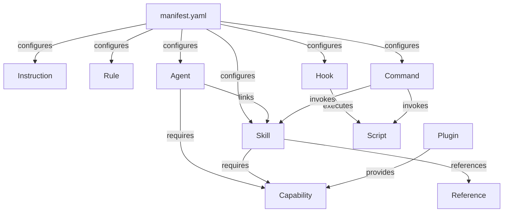

# Examples: GoAgentMeta Language

This directory contains worked examples that progress from beginner to advanced. Each example is self-contained and demonstrates real-world usage patterns.

---

## Difficulty Guide

| # | File | Level | Topic |
|---|---|---|---|
| 1 | [01-first-instruction.md](01-first-instruction.md) | 🟢 Beginner | First instruction — hello world |
| 2 | [02-scoped-rule.md](02-scoped-rule.md) | 🟢 Beginner | Scoped conditional rule |
| 3 | [03-basic-skill.md](03-basic-skill.md) | 🟢 Beginner | Basic skill authoring |
| 4 | [04-basic-agent.md](04-basic-agent.md) | 🟡 Intermediate | Agent with linked skill |
| 5 | [05-hooks-and-scripts.md](05-hooks-and-scripts.md) | 🟡 Intermediate | Lifecycle hook + bash script |
| 6 | [06-commands-and-references.md](06-commands-and-references.md) | 🟡 Intermediate | Command + on-demand reference |
| 7 | [07-agentmd-authoring.md](07-agentmd-authoring.md) | 🟡 Intermediate | Authoring AGENT.md files |
| 8 | [08-plugin-mcp.md](08-plugin-mcp.md) | 🔴 Advanced | External MCP plugin wiring |
| 9 | [09-multi-agent-delegation.md](09-multi-agent-delegation.md) | 🔴 Advanced | Multi-agent delegation + handoffs |
| 10 | [10-full-project.md](10-full-project.md) | 🔴 Advanced | Complete `.ai/` project |

---

## How to Read These Examples

Each example shows:
1. The **goal** — what you are trying to achieve
2. The **files** — the actual `.ai/` artifacts to create
3. **Annotations** — inline comments explaining key choices
4. **Mermaid diagrams** where helpful to visualize structure or flow

---

## Entity Dependency Overview

---

## Language Reference

These examples assume familiarity with the language reference documents:

- [../README.md](../README.md) — Entity taxonomy and ObjectMeta
- [../syntax-manifest.md](../syntax-manifest.md) — Manifest
- [../syntax-instruction.md](../syntax-instruction.md) — Instructions
- [../syntax-rule.md](../syntax-rule.md) — Rules
- [../syntax-skill.md](../syntax-skill.md) — Skills
- [../syntax-agent.md](../syntax-agent.md) — Agents
- [../syntax-hook.md](../syntax-hook.md) — Hooks
- [../syntax-command.md](../syntax-command.md) — Commands
- [../syntax-capability.md](../syntax-capability.md) — Capabilities
- [../syntax-plugin.md](../syntax-plugin.md) — Plugins
- [../syntax-reference.md](../syntax-reference.md) — References and Assets
- [../syntax-script.md](../syntax-script.md) — Scripts
