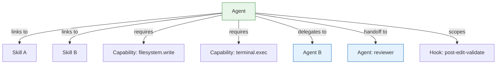

# Syntax Reference: Agent

An **Agent** is a specialized delegate or orchestration wrapper. Agents define a role (system prompt), tool and permission policy, linked skills, required capabilities, allowed delegations, guided handoffs to other agents, and scoped hooks. An agent is not a tool provider — it is a policy and orchestration surface around tools, skills, and delegation.

---

## Quick Example

The primary authoring format is a **Markdown file with YAML frontmatter**:

```markdown
---
id: go-implementer
kind: agent
description: Implement Go services with tests and documentation
preservation: preferred
skills:
  - go-aws-lambda
  - golang-benchmark
requires:
  - filesystem.read
  - filesystem.write
  - terminal.exec
  - repo.search
tools:
  - Edit
  - Bash
disallowedTools:
  - WebFetch
delegation:
  mayCall:
    - test-runner
    - docs-generator
handoffs:
  - label: Start Review
    agent: security-reviewer
    prompt: |
      Review the implementation above for security issues.
      Pay special attention to input validation and credential handling.
    autoSend: false
hooks:
  - post-edit-validate
model: claude-opus-4
---

You are a Go implementation specialist.
Produce minimal, correct code changes with full test coverage.
Follow the project's hexagonal architecture conventions.
Always run `go vet` and `golangci-lint` before reporting completion.
```

Save this as `.ai/agents/go-implementer.md`. The frontmatter holds all structured agent metadata; the body becomes the agent's system prompt (rolePrompt).

---

## Field Reference

### Inherited from ObjectMeta

See [ObjectMeta reference](README.md#common-envelope--objectmeta). Key fields for agents:

| Field | Typical Usage for Agents |
|---|---|
| `id` | Kebab-case role name: `go-implementer`, `security-reviewer`, `test-runner` |
| `kind` | Always `agent` |
| `description` | Short summary of the agent's specialization |
| `preservation` | Usually `preferred`; `required` for mandatory security review agents |
| `scope` | Agents are usually repo-wide; scope if the agent only applies to a subtree |

### `rolePrompt`

```yaml
rolePrompt: |
  You are a Go implementation specialist. Produce minimal, correct
  code changes with full test coverage. Always run go vet first.
```

| Field | Type | Required | Description |
|---|---|---|---|
| `rolePrompt` | string | yes | The system prompt that defines this agent's specialization, persona, and behavioral constraints. Full Markdown supported. |

This is the core of the agent definition. Write it as a clear, imperative system prompt. Include:
- Role and specialization
- Behavioral constraints (what to always do / never do)
- Output format expectations
- Escalation / handoff triggers

### `skills`

```yaml
skills:
  - go-aws-lambda
  - golang-benchmark
  - go-test-expert
```

List of skill IDs this agent has access to. The compiler resolves each ID to a skill in the source tree or in resolved dependencies. The agent can invoke these skills when appropriate.

### `requires`

```yaml
requires:
  - filesystem.read
  - filesystem.write
  - terminal.exec
  - repo.search
  - mcp.github
```

List of capability IDs this agent needs. The compiler validates that every required capability has a provider for each target. See [syntax-capability.md](syntax-capability.md).

### `tools`

```yaml
tools:
  - Edit
  - Bash
  - Read
  - "Bash(go:*)"
```

List of concrete tool names this agent is permitted to use. Entries may be exact tool names or parameterized expressions. This is the same format used by skills.

### `disallowedTools`

```yaml
disallowedTools:
  - WebFetch
```

List of concrete tool names this agent is explicitly denied from using. Any tool not in `tools` or `disallowedTools` follows the target's default policy.

Agents and skills now share the same tool model — both use `tools` (allowed) and `disallowedTools` (denied).

### `delegation`

```yaml
delegation:
  mayCall:
    - test-runner
    - docs-generator
    - security-reviewer
```

Controls which other agents this agent may call as subagents.

| Field | Type | Description |
|---|---|---|
| `delegation.mayCall` | []string | Agent IDs this agent is allowed to delegate to. Delegation is validated against the target's support for subagent calling. |

### `handoffs`

Handoffs define guided sequential workflow transitions. After the agent completes a task, it suggests transitioning to another agent with a pre-filled prompt.

```yaml
handoffs:
  - label: Start Review
    agent: security-reviewer
    prompt: |
      Review the implementation above for security vulnerabilities.
    autoSend: false

  - label: Run Tests
    agent: test-runner
    prompt: Run the full test suite for the changes above.
    autoSend: true
```

Each handoff is a `Handoff` object:

| Field | Type | Required | Description |
|---|---|---|---|
| `label` | string | yes | User-facing button label (e.g., `"Start Review"`, `"Run Tests"`) |
| `agent` | string | yes | Target agent ID to transition to |
| `prompt` | string | yes | Pre-filled prompt text sent to the target agent |
| `autoSend` | bool | no | `true` means the handoff executes automatically; `false` requires user confirmation (default: `false`) |

> **Portability note**: Handoffs are natively supported by GitHub Copilot. They are lowered to prompt suggestions or workflow hints on other targets.

### `hooks`

```yaml
hooks:
  - post-edit-validate
  - session-start-setup
```

List of hook IDs scoped to this agent. The referenced hooks are only triggered when this agent is active. See [syntax-hook.md](syntax-hook.md).

### `model`

```yaml
model: claude-opus-4
```

Optional preferred model identifier for this agent. The target renderer uses this hint when the target platform supports model selection per agent.

---

## Agent Relationships



---

## Delegation vs. Handoff

| Aspect | Delegation (`mayCall`) | Handoff |
|---|---|---|
| Direction | Agent calls subagent programmatically | User-triggered transition |
| Automation | Autonomous | Manual (or `autoSend: true`) |
| Target support | Depends on target subagent support | Native in Copilot; lowered elsewhere |
| Use case | Parallel/sequential subtasks | Sequential workflow steps (implement → review → deploy) |

---

## Target Mapping

| Target | Agent support | Handoff support | Delegation support |
|---|---|---|---|
| `claude` | Native subagent system | Lowered to prompt suggestion | Native |
| `cursor` | Emulated via context | Not supported | Not supported |
| `copilot` | Native agents (Copilot Spaces) | Native (Copilot handoffs) | Partial |
| `codex` | Native agents | Lowered to prompt suggestion | Native |

---

## See Also

- [syntax-skill.md](syntax-skill.md) — Skills linked to agents
- [syntax-hook.md](syntax-hook.md) — Hooks scoped to agents
- [syntax-capability.md](syntax-capability.md) — Capability identifiers
- [examples/04-basic-agent.md](examples/04-basic-agent.md) — Beginner agent example
- [examples/09-multi-agent-delegation.md](examples/09-multi-agent-delegation.md) — Advanced delegation example
