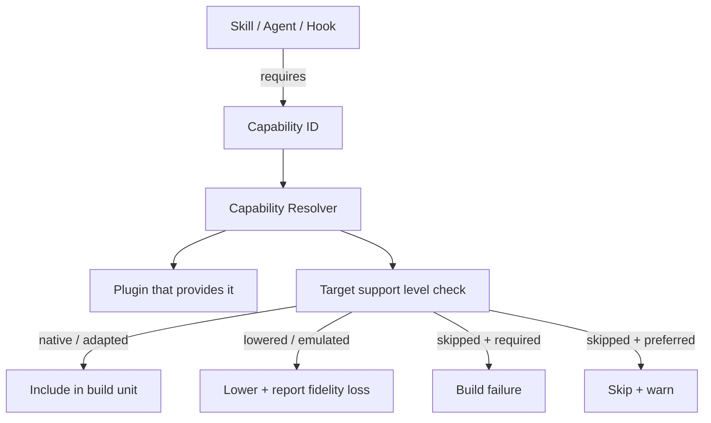

# Syntax Reference: Capability

A **Capability** is an abstract contract that authoring primitives (skills, agents, commands, hooks) may require. Capabilities are not tools — they are named contracts that describe a category of functionality. The compiler resolves each capability ID to a concrete provider (typically a plugin) and validates that the provider is available for each target.

---

## Quick Example

```yaml
id: repo.graph.query
kind: capability
description: Query repository structure and call graphs

contract:
  category: tool
  description: Query repository structure, file relationships, and call graphs

security:
  network: none
  filesystem: read-repo
```

---

## Field Reference

### Inherited from ObjectMeta

See [ObjectMeta reference](README.md#common-envelope--objectmeta). Key fields for capabilities:

| Field | Typical Usage for Capabilities |
|---|---|
| `id` | Dot-namespaced identifier: `filesystem.read`, `terminal.exec`, `mcp.github` |
| `kind` | Always `capability` |
| `description` | Short summary of what this capability provides |
| `preservation` | Not usually set on capabilities directly; set on the primitives that require them |

### `contract`

```yaml
contract:
  category: tool
  description: Execute arbitrary shell commands in the repository
```

| Field | Type | Required | Description |
|---|---|---|---|
| `contract.category` | string | yes | Functional category of the capability. See categories below. |
| `contract.description` | string | yes | Human-readable description of what this capability provides at runtime. |

#### Capability Categories

| Category | Description |
|---|---|
| `tool` | A named AI tool (e.g., Bash, Read, Write, Glob) |
| `mcp` | A Model Context Protocol server providing tools or resources |
| `service` | An external service (API, database, message queue) |
| `filesystem` | Filesystem read/write access |
| `network` | Network access for outbound/inbound HTTP or other protocols |
| `secrets` | Access to secrets and credentials stores |
| `repo` | Repository-level operations (search, graph, history) |

### `security`

```yaml
security:
  network: none
  filesystem: read-repo
```

Declares the permission requirements for this capability. Used by the compiler and runtime to validate that the target environment can safely provide the capability.

| Field | Type | Default | Description |
|---|---|---|---|
| `security.network` | string | `none` | Network access needed: `none`, `outbound`, `inbound`, `bidirectional` |
| `security.filesystem` | string | `none` | Filesystem access needed: `none`, `read-repo`, `read-write`, `read-write-system` |

---

## Standard Built-in Capability IDs

These capability IDs are understood by the built-in compiler stages and built-in renderers. You may define additional custom capabilities for your own plugins.

### Filesystem

| ID | Description |
|---|---|
| `filesystem.read` | Read files within the repository |
| `filesystem.write` | Write or modify files within the repository |
| `filesystem.read-system` | Read files outside the repository (system-level) |

### Terminal / Execution

| ID | Description |
|---|---|
| `terminal.exec` | Execute arbitrary shell commands |
| `terminal.exec-restricted` | Execute commands from a pre-approved allowlist only |

### Repository

| ID | Description |
|---|---|
| `repo.search` | Full-text and semantic search across repository files |
| `repo.graph.query` | Query call graphs, import graphs, and file relationships |
| `repo.history` | Access git history and blame information |

### MCP Servers

| ID | Description |
|---|---|
| `mcp.github` | GitHub API access via MCP server |
| `mcp.slack` | Slack API access via MCP server |
| `mcp.jira` | Jira API access via MCP server |
| `mcp.postgres` | PostgreSQL database access via MCP server |
| `mcp.memory` | Persistent agent memory via MCP server |

### Network

| ID | Description |
|---|---|
| `network.http.outbound` | Outbound HTTP/HTTPS requests |

### Secrets

| ID | Description |
|---|---|
| `secrets.read` | Read secrets from a secrets store (Vault, AWS Secrets Manager, etc.) |

---

## Support Levels

The compiler evaluates each capability against each target's support level, which drives lowering decisions:

| Level | Meaning |
|---|---|
| `native` | First-class support exists in the target — no lowering needed |
| `adapted` | Same semantics, different syntax or file placement — lowering is transparent |
| `lowered` | The compiler maps the concept to another primitive — some fidelity may be lost |
| `emulated` | Only an approximation exists — behavior may differ from canonical intent |
| `skipped` | Capability is not available on this target |

When a required capability has support level `skipped` and the requiring object has `preservation: required`, the build fails.

---

## Capability Resolution Flow



---

## Defining Custom Capabilities

You can define project-specific capabilities for your own plugins:

```yaml
# .ai/capabilities/internal-graph.yaml
id: acme.graph.query
kind: capability
description: Query ACME's internal service dependency graph

contract:
  category: service
  description: Resolves service-to-service dependencies and API compatibility

security:
  network: outbound
  filesystem: none
```

Then reference it in a plugin:

```yaml
# .ai/plugins/acme-graph.yaml
id: acme-graph
kind: plugin
provides:
  capabilities:
    - acme.graph.query
```

And require it from a skill or agent:

```yaml
requires:
  - acme.graph.query
```

---

## See Also

- [syntax-plugin.md](syntax-plugin.md) — Plugins that provide capabilities
- [syntax-skill.md](syntax-skill.md) — Skills that require capabilities
- [syntax-agent.md](syntax-agent.md) — Agents that require capabilities
