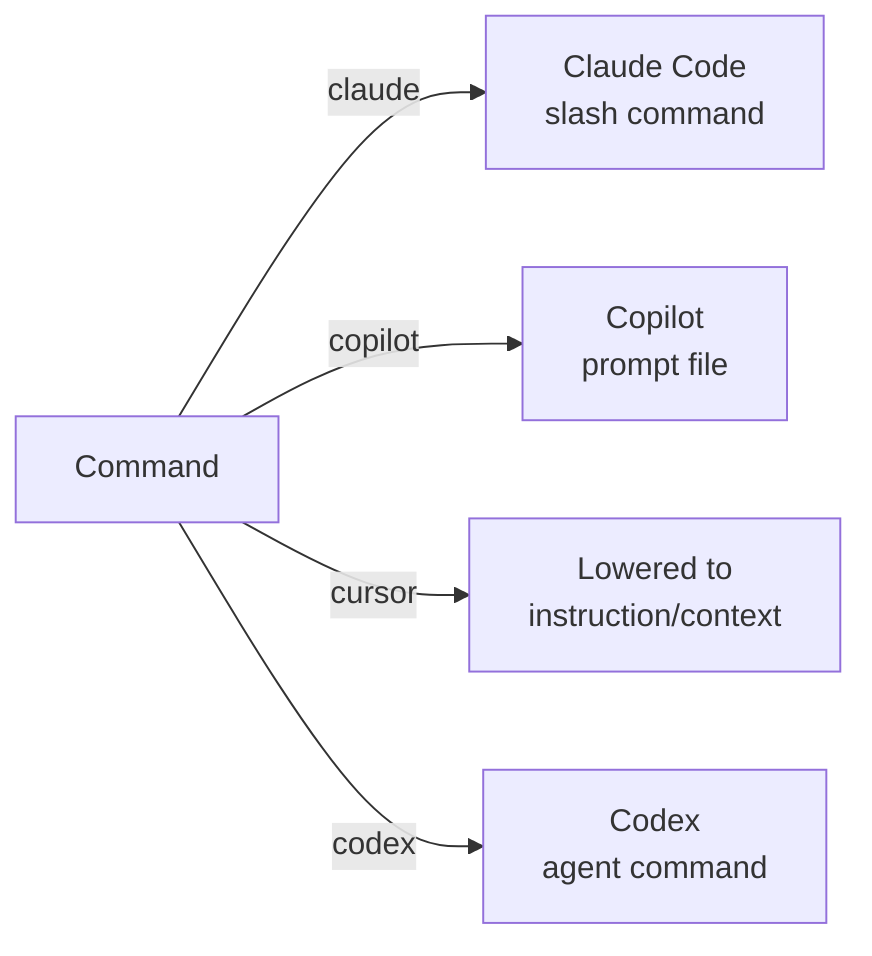

# Syntax Reference: Command

A **Command** is an explicit user-invoked entry point — a named action the user triggers intentionally (e.g., `/review-iam`, `/build-lambda`, `/scaffold-service`). Commands are the mechanism for guided, on-demand workflows distinct from always-on instructions or automatic hooks.

---

## Quick Example

```yaml
id: review-iam
kind: command
description: Review IAM policies for security best practices
preservation: preferred

action:
  type: skill
  ref: iam-security-review
```

A prompt-based command:

```yaml
id: scaffold-service
kind: command
description: Scaffold a new Go microservice with hexagonal architecture
preservation: preferred

action:
  type: prompt
  ref: |
    You are scaffolding a new Go microservice.
    Ask me for the service name, then create the full directory structure
    following hexagonal architecture: domain/, application/, port/, adapter/.
    Create an initial README.md, go.mod, and a basic main.go.
```

A script-based command:

```yaml
id: run-benchmarks
kind: command
description: Run all Go benchmarks and generate a benchstat comparison report
preservation: preferred

action:
  type: script
  ref: scripts/commands/run-benchmarks.sh
```

---

## Field Reference

### Inherited from ObjectMeta

See [ObjectMeta reference](README.md#common-envelope--objectmeta). Key fields for commands:

| Field | Typical Usage for Commands |
|---|---|
| `id` | Short verb-noun: `review-iam`, `build-lambda`, `scaffold-service` |
| `kind` | Always `command` |
| `description` | User-facing description shown in command palettes and help |
| `preservation` | Usually `preferred`; `required` if the command is essential tooling |
| `scope` | Commands are usually repo-wide; scope if relevant only to a subtree |

### `description`

```yaml
description: Review IAM policies for security best practices
```

| Field | Type | Required | Description |
|---|---|---|---|
| `description` | string | yes | Human-readable summary of what this command does. Shown in command palettes, `/help` listings, and marketplace UIs. |

### `action`

```yaml
action:
  type: skill
  ref: iam-security-review
```

Defines what the command executes when invoked.

| Field | Type | Required | Description |
|---|---|---|---|
| `action.type` | string | yes | Action kind. See action types below. |
| `action.ref` | string | yes | Reference to the action target. Interpretation depends on `type`. |

#### Action Types

| Type | `ref` format | Description |
|---|---|---|
| `skill` | Skill ID | Invoke the specified skill as the command body |
| `prompt` | Inline prompt string | Send a prompt to the AI when the command is invoked |
| `script` | Relative path to `.ai/scripts/` | Execute a shell script |
| `agent` | Agent ID | Activate the specified agent |

---

## Target Mapping

Commands map to different native surfaces per target. The compiler handles the translation:

| Target | Native Surface | Notes |
|---|---|---|
| `claude` | Claude Code slash commands (skills) | `userInvocable: true` on a skill, or a dedicated command definition |
| `copilot` | Copilot prompt files (`.github/copilot/`) | `action.type: prompt` maps naturally; `action.type: skill` becomes a prompt file |
| `cursor` | No native command surface | Lowered to an instruction or reference context; `preservation: optional` recommended |
| `codex` | Agent slash commands | Maps to Codex agent entry points |



---

## Invocation Pattern

From the user's perspective:
- **Claude Code**: `/review-iam` in the chat
- **Copilot**: Select prompt file in the Copilot chat panel
- **Codex**: `/review-iam` in the agent interface

---

## Linking References

Commands often benefit from a linked reference document that provides in-depth context loaded on-demand:

```yaml
id: review-iam
kind: command
description: Review IAM policies for security best practices
preservation: preferred

action:
  type: prompt
  ref: |
    You are an AWS IAM security reviewer.
    Read `.ai/references/iam-best-practices.md` for the full policy standard,
    then review all IAM policy documents in the current workspace.
    Report each finding with: severity, resource ARN, violation, and recommendation.
```

This keeps the command definition concise while pointing the AI at demand-loaded reference material. See [syntax-reference.md](syntax-reference.md).

---

## Minimal Form

```yaml
id: format-code
kind: command
description: Format all Go files in the repository
action:
  type: script
  ref: scripts/commands/format.sh
```

---

## See Also

- [syntax-skill.md](syntax-skill.md) — Skills as command bodies
- [syntax-script.md](syntax-script.md) — Scripts as command actions
- [syntax-reference.md](syntax-reference.md) — Reference docs linked from commands
- [examples/06-commands-and-references.md](examples/06-commands-and-references.md) — Commands example
