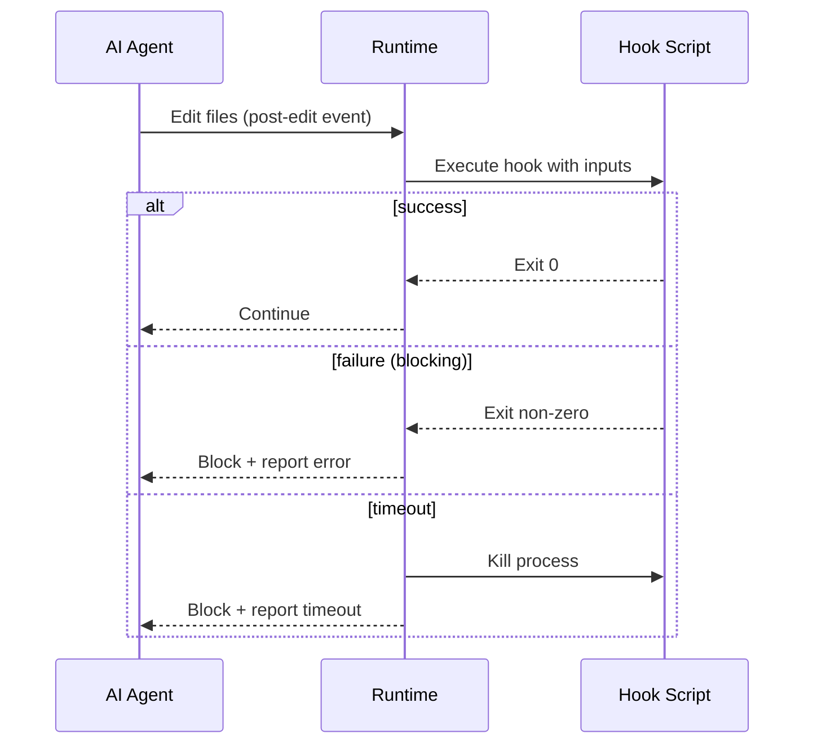

# Syntax Reference: Hook

A **Hook** is deterministic lifecycle automation triggered by defined events. Hooks carry explicit effect semantics — the compiler uses these to determine whether a hook can be safely lowered, and how strictly to enforce its outcome.

Hooks are **highly non-portable across targets**. Different platforms support different event types and enforcement mechanisms. Use `preservation: required` only if you must have the hook on every target; otherwise `preferred` allows the compiler to skip hooks on targets that do not support them.

---

## Quick Example

```yaml
id: post-edit-validate
kind: hook
description: Validate changed files after every edit
preservation: preferred
scope:
  paths:
    - "services/**"
event: post-edit

action:
  type: script
  ref: scripts/hooks/post-edit-validate.sh

effect:
  class: validating
  enforcement: blocking

inputs:
  include:
    - changedFiles
    - workingDirectory

policy:
  timeoutSeconds: 60
  maxRetries: 0
  failurePolicy: fail-build
```

---

## Field Reference

### Inherited from ObjectMeta

See [ObjectMeta reference](README.md#common-envelope--objectmeta). Key fields for hooks:

| Field | Typical Usage for Hooks |
|---|---|
| `id` | Descriptive name: `post-edit-validate`, `pre-tool-use-check`, `session-start-setup` |
| `kind` | Always `hook` |
| `preservation` | Usually `preferred`; `required` for mandatory compliance checks |
| `scope` | Restrict the hook to specific paths or file types |
| `appliesTo` | Restrict to targets that support the event type |

### `event`

```yaml
event: post-edit
```

The lifecycle event that triggers this hook. Standard event identifiers:

| Event | Trigger Point |
|---|---|
| `post-edit` | After the AI edits one or more files |
| `pre-tool-use` | Before the AI executes a tool |
| `post-tool-use` | After the AI executes a tool |
| `session-start` | When an AI session begins |
| `session-end` | When an AI session ends |
| `pre-commit` | Before a git commit is made |

> Target support varies. `post-edit` is the most broadly supported event.

### `action`

```yaml
action:
  type: script
  ref: scripts/hooks/post-edit-validate.sh
```

Defines what the hook executes when triggered.

| Field | Type | Required | Description |
|---|---|---|---|
| `action.type` | string | yes | Action kind. See action types below. |
| `action.ref` | string | yes | Reference to the action target. Interpretation depends on `type`. |

#### Action Types

| Type | `ref` format | Description |
|---|---|---|
| `script` | Relative path to `.ai/scripts/` | Execute a shell script |
| `command` | Command ID | Invoke a registered command |
| `http` | URL | Make an HTTP request to a webhook endpoint |
| `prompt` | Inline prompt text or file path | Send a prompt to the AI |
| `agent` | Agent ID | Delegate to another agent |

### `effect`

```yaml
effect:
  class: validating
  enforcement: blocking
```

Describes the **semantic impact** and **enforcement mode** of this hook. The compiler uses this to determine whether the hook can be safely lowered.

#### `effect.class`

| Class | Meaning |
|---|---|
| `observing` | Read-only monitoring — collects data, emits metrics, writes logs |
| `validating` | Checks correctness — may block or warn if validation fails |
| `transforming` | Mutates files or state — high portability concern |
| `setup` | Initializes environment or session state |
| `reporting` | Generates reports, summaries, or provenance records |

#### `effect.enforcement`

| Enforcement | Meaning |
|---|---|
| `blocking` | The hook's result gates the next action. If the hook fails, the workflow stops. |
| `advisory` | The hook runs and reports; failures produce warnings but do not stop execution. |
| `best-effort` | The hook is attempted; if the target does not support it, it is silently skipped. |

### `inputs`

```yaml
inputs:
  include:
    - changedFiles
    - workingDirectory
    - toolName
    - toolInput
```

Specifies which context data the hook receives when triggered. The runtime injects these values into the hook's execution environment.

| Input Key | Available For Events | Description |
|---|---|---|
| `changedFiles` | `post-edit` | List of files changed in the triggering edit |
| `workingDirectory` | all | Current working directory |
| `toolName` | `pre-tool-use`, `post-tool-use` | Name of the tool being invoked |
| `toolInput` | `pre-tool-use` | Input parameters passed to the tool |
| `toolOutput` | `post-tool-use` | Output produced by the tool |
| `sessionId` | `session-start`, `session-end` | Unique identifier for the AI session |

### `policy`

```yaml
policy:
  timeoutSeconds: 60
  maxRetries: 2
  failurePolicy: fail-build
```

Controls operational behavior during hook execution.

| Field | Type | Default | Description |
|---|---|---|---|
| `timeoutSeconds` | int | `30` | Maximum wall-clock seconds the hook may run before being killed |
| `maxRetries` | int | `0` | Number of retry attempts on transient failures. `0` means no retries. |
| `failurePolicy` | string | `"fail-build"` | What happens after all retries are exhausted: `fail-build`, `warn`, or `ignore` |

---

## Hook Lifecycle



---

## Effect × Enforcement Matrix

| Effect Class | `blocking` | `advisory` | `best-effort` |
|---|---|---|---|
| `observing` | Unusual — observing rarely needs to block | ✅ Common | ✅ Common |
| `validating` | ✅ Common — validation gates the next step | ✅ Common | Use for optional checks |
| `transforming` | ✅ Needed — transformations must succeed | Risky — partial transforms may corrupt state | Avoid |
| `setup` | ✅ When setup is mandatory | Use when setup enhances but is not required | ✅ For optional setup |
| `reporting` | Rarely appropriate | ✅ Common | ✅ Common |

---

## Target Support Matrix

| Event | `claude` | `cursor` | `copilot` | `codex` |
|---|---|---|---|---|
| `post-edit` | ✅ Native | ✅ Native | ⚠️ Lowered | ✅ Native |
| `pre-tool-use` | ✅ Native | ❌ | ❌ | ✅ Native |
| `post-tool-use` | ✅ Native | ❌ | ❌ | ✅ Native |
| `session-start` | ✅ Native | ✅ Native | ⚠️ Lowered | ✅ Native |
| `session-end` | ✅ Native | ❌ | ❌ | ⚠️ Lowered |
| `pre-commit` | ❌ (use git hooks) | ❌ | ❌ | ❌ |

✅ Native / ⚠️ Lowered / ❌ Not supported

---

## See Also

- [syntax-script.md](syntax-script.md) — Script syntax for hook actions
- [syntax-agent.md](syntax-agent.md) — Scoping hooks to agents
- [examples/05-hooks-and-scripts.md](examples/05-hooks-and-scripts.md) — Hooks example
