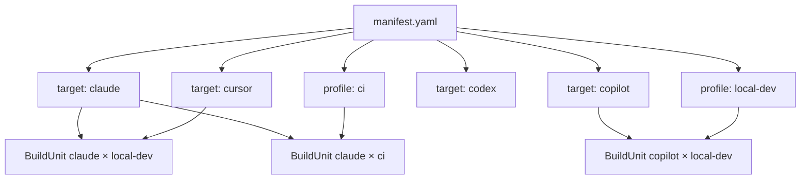

# Syntax Reference: Manifest

The **manifest** (`manifest.yaml`) is the root configuration file for the `.ai/` source tree. It defines build defaults, target and profile configuration, compiler policy, package dependencies, and registry settings. Every `.ai/` project must have a manifest.

---

## Quick Example

```yaml
schemaVersion: 1
project:
  name: my-service
  monorepo: false

build:
  defaultTargets: [claude, copilot]
  defaultProfiles: [local-dev, ci]
  outputRoot: .ai-build
  syncMode: explicit

compilation:
  hierarchyMode: preserve-when-supported
  materialization: copy-or-symlink
  unsupportedMode: fail-on-required
  provenance: full

preservation:
  default: preferred

dependencies:
  "@acme/go-lambda-skill": "^1.3.0"
```

---

## Field Reference

### `schemaVersion`

```yaml
schemaVersion: 1
```

Integer schema version for the manifest format. Currently `1`.

---

### `project`

General project metadata.

```yaml
project:
  name: my-service       # Project name (used in build reports)
  monorepo: false        # true if this is a monorepo with multiple service roots
```

| Field | Type | Default | Description |
|---|---|---|---|
| `name` | string | `""` | Project name used in build reports and provenance |
| `monorepo` | bool | `false` | When `true`, the compiler may traverse subtree roots |

---

### `build`

Controls which targets and profiles are compiled by default, where output is written, and how synchronization works.

```yaml
build:
  defaultTargets:
    - claude
    - cursor
    - copilot
    - codex
  defaultProfiles:
    - local-dev
  outputRoot: .ai-build
  syncMode: explicit
```

| Field | Type | Default | Description |
|---|---|---|---|
| `defaultTargets` | []string | `[]` | Targets compiled when none are specified on the CLI |
| `defaultProfiles` | []string | `[]` | Profiles compiled when none are specified on the CLI |
| `outputRoot` | string | `.ai-build` | Root directory for all compiler output |
| `syncMode` | string | `explicit` | How the materializer handles stale output: `explicit` (only explicit writes) or `clean` (delete-and-rebuild) |

#### Available Targets

| Target | Description |
|---|---|
| `claude` | Claude Code (Anthropic) |
| `cursor` | Cursor IDE |
| `copilot` | GitHub Copilot |
| `codex` | OpenAI Codex / Agents |

---

### `compilation`

Controls how the compiler handles hierarchy, materialization, unsupported concepts, and provenance recording.

```yaml
compilation:
  hierarchyMode: preserve-when-supported
  materialization: copy-or-symlink
  unsupportedMode: fail-on-required
  provenance: full
```

| Field | Type | Default | Description |
|---|---|---|---|
| `hierarchyMode` | string | `preserve-when-supported` | How directory/scope hierarchy is emitted: `preserve-when-supported` or `flatten` |
| `materialization` | string | `copy-or-symlink` | How files are written: `copy-or-symlink`, `copy`, or `symlink` |
| `unsupportedMode` | string | `fail-on-required` | What to do when a `required` object cannot be lowered: `fail-on-required` or `warn-all` |
| `provenance` | string | `full` | Provenance detail level: `full`, `summary`, or `none` |

---

### `preservation`

Sets the default preservation level for objects that do not specify their own.

```yaml
preservation:
  default: preferred     # required | preferred | optional
```

| Field | Type | Default | Description |
|---|---|---|---|
| `default` | Preservation | `preferred` | Default preservation level for objects without an explicit `preservation` field |

See [ObjectMeta — Preservation](README.md#preservation) for level semantics.

---

### `targets`

Per-target enablement and configuration overrides.

```yaml
targets:
  claude:
    enabled: true
  cursor:
    enabled: true
  copilot:
    enabled: true
  codex:
    enabled: false
```

| Field | Type | Default | Description |
|---|---|---|---|
| `enabled` | bool | `true` | Whether this target participates in default compilation runs |

---

### `profiles`

Maps profile names to their definition files.

```yaml
profiles:
  local-dev: profiles/local-dev.yaml
  ci: profiles/ci.yaml
  enterprise-locked: profiles/enterprise-locked.yaml
  oss-public: profiles/oss-public.yaml
```

Each profile file defines policy adjustments applied when building for that profile. Standard profile names:

| Profile | Intended Environment |
|---|---|
| `local-dev` | Local developer workstation |
| `ci` | Continuous integration pipeline |
| `enterprise-locked` | Enterprise environment with strict security policies |
| `oss-public` | Open-source project with public contributors |

---

### `dependencies`

Package dependencies resolved from registries. Uses a subset of semver constraint syntax.

```yaml
dependencies:
  "@acme/go-lambda-skill": "^1.3.0"
  "@community/github-mcp": "~2.1.0"
  "@org/security-rules": "1.0.0"
```

The key is the package identifier (namespaced with `@org/` prefix) and the value is a version constraint:

| Constraint | Meaning |
|---|---|
| `"1.2.3"` | Exact version |
| `"^1.2.3"` | Compatible with 1.x.x (semver `^`) |
| `"~1.2.3"` | Patch-level compatible (semver `~`) |
| `">=1.0.0"` | Minimum version |

---

### `registries`

Registry servers searched when resolving dependencies. Registries are searched in `priority` order (lower number = higher priority).

```yaml
registries:
  - name: acme-internal
    url: https://registry.acme.com/ai-packages
    priority: 1
    auth:
      type: bearer
      tokenEnv: ACME_REGISTRY_TOKEN
  - name: community
    url: https://registry.aicontrolplane.dev/v1
    priority: 2
```

| Field | Type | Description |
|---|---|---|
| `name` | string | Logical registry name for diagnostics |
| `url` | string | Base URL of the registry API |
| `priority` | int | Search priority (lower = higher priority) |
| `auth.type` | string | Authentication type: `bearer`, `basic`, or `none` |
| `auth.tokenEnv` | string | Environment variable name holding the bearer token |

---

### `compiler.plugins`

Registers additional compiler stage plugins beyond the built-in stages. Plugins can implement any pipeline phase.

```yaml
compiler:
  plugins:
    - name: acme-custom-lowering
      source: ./plugins/acme-lowering.so
      phase: lower
      order: 50
    - name: docs-renderer
      source: external://docs-renderer
      phase: render
      target: docs
```

| Field | Type | Description |
|---|---|---|
| `name` | string | Unique plugin name for logging and diagnostics |
| `source` | string | Plugin location: relative path (`.so` Go plugin), `external://name` (subprocess), or registry reference |
| `phase` | string | Pipeline phase this plugin participates in: `parse`, `validate`, `resolve`, `normalize`, `plan`, `capability`, `lower`, `render`, `materialize`, `report` |
| `order` | int | Execution order within the phase (lower runs first) |
| `target` | string | For render-phase plugins: the target this renderer handles |

---

## Build Coordinate Model



Each `(target, profile)` pair produces one **Build Unit** — the fundamental compilation unit. The compiler may produce many build units per run.

---

## See Also

- [README.md](README.md) — Entity taxonomy and ObjectMeta reference
- [syntax-instruction.md](syntax-instruction.md) — Instruction syntax
- [syntax-skill.md](syntax-skill.md) — Skill syntax
