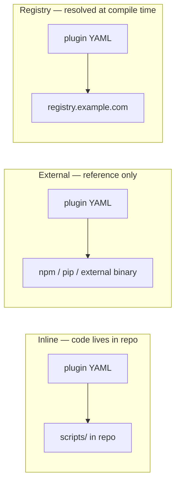

# Syntax Reference: Plugin

A **Plugin** is a deployable extension package that provides capabilities, tool manifests, MCP server bindings, or other target-native integration points. Plugins are **runtime-facing** (distinct from [Skills](syntax-skill.md) which are model-facing).

A plugin *provides* capabilities; skills and agents *require* them. The compiler resolves this graph and emits the correct target-native configuration (MCP server config, settings.json entries, etc.).

Plugins come in three distribution modes: **inline**, **external**, and **registry**.

---

## Distribution Modes



---

## Mode 1: Inline Plugin

The plugin's implementation lives in the repository (typically in `.ai/scripts/plugins/`).

```yaml
id: repo-graph
kind: plugin
description: Provides repository graph queries as a runtime extension
preservation: optional

metadata:
  name: Repo Graph

distribution:
  mode: inline

provides:
  capabilities:
    - repo.graph.query

security:
  trust: review-required
  permissions:
    filesystem: read-repo
    network: none

artifacts:
  scripts:
    - scripts/plugins/repo-graph/server.sh

targets:
  codex:
    packaging:
      kind: native-plugin
      sourceDir: targets/codex/plugins/repo-graph
  cursor:
    packaging:
      kind: mcp-server
      entrypoint: scripts/plugins/repo-graph/server.sh
  claude:
    packaging:
      kind: mcp-server
      entrypoint: scripts/plugins/repo-graph/server.sh
```

---

## Mode 2: External Plugin

The plugin references an externally distributed package. The compiler does not bundle it — it emits the correct target-native install or reference configuration.

```yaml
id: github-mcp
kind: plugin
description: GitHub API access through MCP
preservation: preferred

metadata:
  name: GitHub MCP

distribution:
  mode: external
  ref: "@modelcontextprotocol/server-github"

provides:
  capabilities:
    - mcp.github

security:
  trust: verified-publisher
  permissions:
    network: outbound
    secrets:
      - GITHUB_TOKEN

targets:
  claude:
    install:
      kind: mcp-server-ref
      command: npx
      args: ["-y", "@modelcontextprotocol/server-github"]
      env:
        GITHUB_TOKEN: "${GITHUB_TOKEN}"
  cursor:
    install:
      kind: mcp-server-ref
      command: npx
      args: ["-y", "@modelcontextprotocol/server-github"]
  copilot:
    install:
      kind: mcp-server-ref
      command: npx
      args: ["-y", "@modelcontextprotocol/server-github"]
  codex:
    install:
      kind: mcp-server-ref
      command: npx
      args: ["-y", "@modelcontextprotocol/server-github"]
```

---

## Mode 3: Registry Plugin

The plugin is resolved from a registry at compile time. The compiler fetches the plugin package and emits it according to the distribution metadata in the package.

```yaml
id: acme-graph
kind: plugin
description: ACME internal graph queries
preservation: optional

metadata:
  name: ACME Graph

distribution:
  mode: registry
  source: "registry.acme.com/plugins/acme-graph"
  version: "^1.2.0"

provides:
  capabilities:
    - acme.graph.query

security:
  trust: review-required
  permissions:
    filesystem: read-repo
    network: none
```

---

## Field Reference

### Inherited from ObjectMeta

See [ObjectMeta reference](README.md#common-envelope--objectmeta). Key fields for plugins:

| Field | Typical Usage for Plugins |
|---|---|
| `id` | Short kebab-case name: `github-mcp`, `repo-graph`, `acme-graph` |
| `kind` | Always `plugin` |
| `description` | What this plugin does at runtime |
| `preservation` | Usually `preferred` or `optional`; `required` only for mandatory infrastructure |

### `metadata`

```yaml
metadata:
  name: GitHub MCP
```

| Field | Type | Description |
|---|---|---|
| `metadata.name` | string | Display name for build reports and marketplace UIs |

### `distribution`

```yaml
distribution:
  mode: inline          # inline | external | registry
  ref: "@org/package"   # external only: npm/pip/etc. package reference
  source: "registry.example.com/plugins/foo"  # registry only
  version: "^1.2.0"    # registry only: version constraint
```

| Field | Type | Required | Description |
|---|---|---|---|
| `distribution.mode` | string | yes | Plugin distribution mode: `inline`, `external`, or `registry` |
| `distribution.ref` | string | external mode | Package reference for external plugins (npm, pip, binary) |
| `distribution.source` | string | registry mode | Registry base URL and package path |
| `distribution.version` | string | registry mode | Semver version constraint |

### `provides`

```yaml
provides:
  capabilities:
    - mcp.github
    - repo.search
```

| Field | Type | Description |
|---|---|---|
| `provides.capabilities` | []string | List of capability IDs that this plugin satisfies |

### `security`

```yaml
security:
  trust: verified-publisher
  permissions:
    filesystem: read-repo
    network: outbound
    processExec: true
    secrets:
      - GITHUB_TOKEN
      - AWS_ACCESS_KEY_ID
```

| Field | Type | Description |
|---|---|---|
| `security.trust` | string | Trust level: `verified-publisher`, `review-required`, `untrusted` |
| `security.permissions.filesystem` | string | Filesystem access: `none`, `read-repo`, `read-write` |
| `security.permissions.network` | string | Network access: `none`, `outbound`, `inbound`, `bidirectional` |
| `security.permissions.processExec` | bool | Whether the plugin may spawn child processes (default: `false`) |
| `security.permissions.secrets` | []string | Environment variable names containing secrets the plugin needs |

### `selection`

Controls how the compiler selects this plugin during capability resolution.

```yaml
selection: auto-if-selected   # auto-if-selected | opt-in | manual-only | disabled
```

| Value | Description |
|---|---|
| `auto-if-selected` | Automatically selected when a skill/agent requires one of its capabilities (default) |
| `opt-in` | Only selected when explicitly referenced by name in a manifest or profile |
| `manual-only` | Requires manual approval (e.g., interactive prompt during build) |
| `disabled` | Plugin is present but never selected |

### `install`

Controls how the compiler materializes the plugin's artifacts.

```yaml
install: materialize           # materialize | reference-only | auto-detect
```

| Value | Description |
|---|---|
| `materialize` | Copy all plugin artifacts into the build output directory |
| `reference-only` | Emit only a reference/config entry; do not copy files (typical for external plugins) |
| `auto-detect` | Compiler decides based on distribution mode: inline→materialize, external→reference-only |

### `artifacts` (inline mode only)

```yaml
artifacts:
  scripts:
    - scripts/plugins/repo-graph/server.sh
    - scripts/plugins/repo-graph/init.sh
  configs:
    - configs/repo-graph.json
  manifests:
    - manifests/repo-graph-package.yaml
```

| Field | Type | Description |
|---|---|---|
| `artifacts.scripts` | []string | Relative paths to scripts that implement the inline plugin |
| `artifacts.configs` | []string | Relative paths to configuration files bundled with the plugin |
| `artifacts.manifests` | []string | Relative paths to manifest/metadata files describing the plugin package |

### `targets`

Per-target packaging and install configuration. The structure varies by target and `distribution.mode`.

#### MCP Server (`claude`, `cursor`, `copilot`, `codex`)

```yaml
targets:
  claude:
    install:
      kind: mcp-server-ref          # How the target installs/registers the plugin
      command: npx                   # Executable to run
      args: ["-y", "@org/pkg"]      # Arguments passed to command
      env:
        MY_TOKEN: "${MY_TOKEN}"      # Environment variables (support ${VAR} expansion)
      transport: stdio               # stdio | sse (default: stdio)
```

#### Native Plugin (`codex`)

```yaml
targets:
  codex:
    packaging:
      kind: native-plugin
      sourceDir: targets/codex/plugins/my-plugin
```

#### MCP Server (inline — `cursor`, `claude`)

```yaml
targets:
  cursor:
    packaging:
      kind: mcp-server
      entrypoint: scripts/plugins/repo-graph/server.sh
```

---

## Trust Levels

| Trust Level | Description |
|---|---|
| `verified-publisher` | Plugin is from a trusted, known publisher (e.g., official MCP servers from Anthropic, Microsoft) |
| `review-required` | Plugin requires human review before use — build will warn or prompt |
| `untrusted` | Plugin is not reviewed — build will fail unless `preservation: optional` and approved via policy |

---

## See Also

- [syntax-capability.md](syntax-capability.md) — Capabilities that plugins provide
- [syntax-script.md](syntax-script.md) — Scripts used by inline plugins
- [examples/08-plugin-mcp.md](examples/08-plugin-mcp.md) — MCP plugin example
