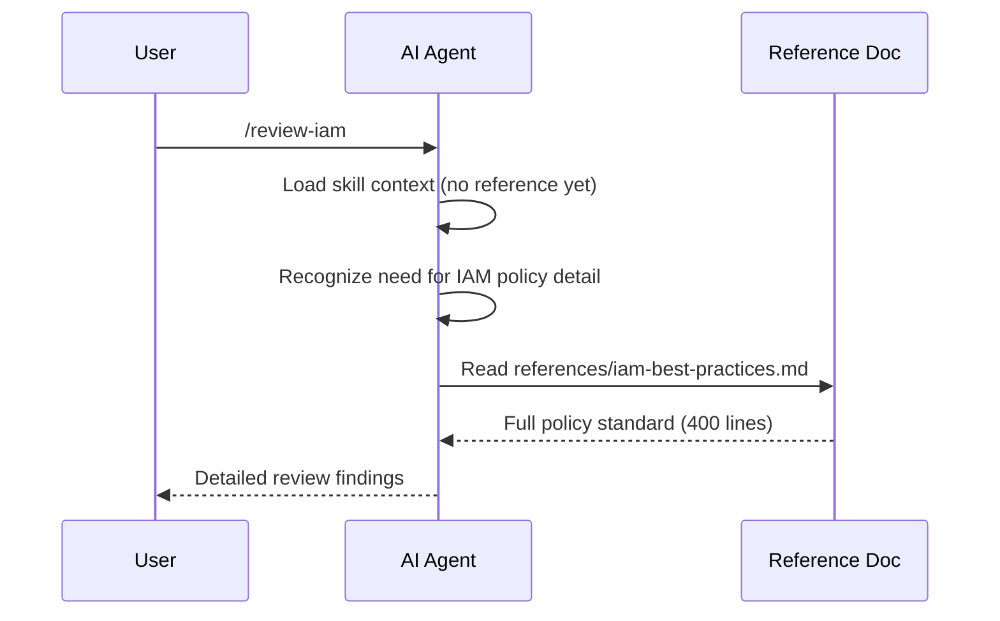

# Syntax Reference: Reference and Asset

**References** and **Assets** are runtime delivery primitives — supplemental files that support the AI model or the build toolchain.

---

## Reference

A **Reference** is a supplemental knowledge document that the AI reads *on demand* when deeper knowledge is needed during a workflow. References are **not** injected into the AI context unconditionally — they are demand-loaded, keeping the context lean.

References are used by skills to point at in-depth material (API docs, architecture patterns, security standards) that the AI should consult when relevant, rather than always reading.

### Reference Declaration

References are declared inline within a skill's `resources.references` list — they are not standalone YAML files. The compiler resolves their paths relative to the `.ai/` root and includes them in the build output.

```yaml
# In a skill definition:
resources:
  references:
    - references/aws-lambda-patterns.md
    - references/sdk-v2-migration.md
    - references/iam-best-practices.md
```

### Reference File

The reference file itself is a plain Markdown document at the declared path:

```markdown
<!-- .ai/references/aws-lambda-patterns.md -->

# AWS Lambda Patterns for Go

This document provides in-depth guidance on Lambda handler patterns,
cold-start optimization, and AWS SDK v2 usage.

## Handler Signature

...
```

No YAML frontmatter is required. The file is the content — write it as a well-structured Markdown document that the AI can navigate.

### Reference Fields (inline declaration)

| Field | Type | Description |
|---|---|---|
| `path` | string | Relative path from the `.ai/` root to the reference Markdown file |
| `description` | string | Optional short summary — surfaced in build reports and IDE tooling |

In the current schema the reference is declared as a path string within the skill's `resources.references` list. A richer form with explicit `path` + `description` may be declared when listing references in an agent's context:

```yaml
# Extended form (in an agent or command context):
resources:
  references:
    - path: references/iam-best-practices.md
      description: "AWS IAM policy authoring guide and security requirements"
```

### Demand-Loading Semantics



The AI decides when to read a reference — the skill's content should mention the reference by name and give the AI a cue:

```markdown
## IAM Review Skill

When reviewing IAM policies, consult `references/iam-best-practices.md`
for the full policy standard including least-privilege requirements
and forbidden actions.
```

### Target Mapping

| Target | Reference Handling |
|---|---|
| `claude` | References emitted as files; AI reads them via the `Read` tool |
| `cursor` | References included in project context as indexed documents |
| `copilot` | References emitted as indexed files in `.github/copilot/` |
| `codex` | References emitted as files; AI reads them on demand |

---

## Asset

An **Asset** is a static file consumed by tooling or emitted into the build output. Assets are not knowledge documents — they are files like templates, diagrams, example configurations, and prompt partials that support skills, hooks, or commands.

### Asset Declaration

```yaml
# In a skill definition:
resources:
  assets:
    - assets/templates/lambda_main.go.tmpl
    - assets/diagrams/service-architecture.png
    - assets/examples/handler-with-sqs.go
```

### Asset File

Assets are arbitrary static files at their declared paths. Common asset types:

| Asset Type | Example | Use Case |
|---|---|---|
| Code template | `lambda_main.go.tmpl` | Template for the AI to scaffold from |
| Diagram | `architecture.png` | Visual aid included in build output |
| Example file | `handler-with-sqs.go` | Working code example the AI can reference |
| Prompt partial | `review-checklist.md` | Fragment assembled into a larger prompt |
| Configuration | `eslint-base.json` | Base config file distributed with the skill |

### Asset vs. Reference

| Aspect | Reference | Asset |
|---|---|---|
| Consumer | AI model (reads for knowledge) | Tooling or AI (uses as a file) |
| Format | Markdown knowledge documents | Any file type |
| Loading | Demand-loaded (AI decides when) | Emitted directly into build output |
| Purpose | In-depth guidance | Templates, examples, configs, diagrams |

---

## Best Practices

**References:**
- Write them as clear, well-structured Markdown that an AI can navigate efficiently
- Keep them focused on a single topic (one reference per major standard or pattern)
- Use explicit headers so the AI can jump to the relevant section
- Name them descriptively: `iam-best-practices.md`, `sdk-v2-migration.md`

**Assets:**
- Use `.tmpl` suffix for templates the AI should fill in
- Add a short comment at the top of code asset files explaining their purpose
- Prefer small, focused assets over large monolithic ones

---

## See Also

- [syntax-skill.md](syntax-skill.md) — Skills declaring references and assets
- [syntax-script.md](syntax-script.md) — Executable scripts (distinct from assets)
- [examples/06-commands-and-references.md](examples/06-commands-and-references.md) — References example
