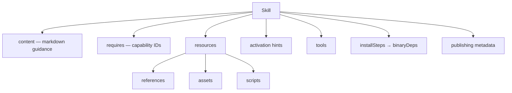

# Syntax Reference: Skill

A **Skill** is a reusable, model-facing workflow bundle. Skills describe *how work should be done* — build a Lambda, review IAM policies, scaffold a bounded context, run benchmarks. They are portable across targets and follow the [AgentSkills.io](https://agentskills.io) open standard.

A skill is **model-facing content** (guidance, examples, templates) — distinct from a [Plugin](syntax-plugin.md) which is a **runtime-facing integration** (MCP server, tool manifest).

---

## Canonical Form (`.ai/skills/`)

The primary authoring format is a **Markdown file with YAML frontmatter**:

```markdown
---
id: go-aws-lambda
kind: skill
description: Build and validate Go Lambda services with AWS SDK v2
packageVersion: "1.3.0"
license: MIT
preservation: preferred
scope:
  paths:
    - "services/**"
labels:
  - go
  - lambda
  - aws
requires:
  - terminal.exec
  - repo.search
resources:
  references:
    - references/aws-lambda-patterns.md
    - references/sdk-v2-migration.md
  assets:
    - assets/templates/lambda_main.go.tmpl
  scripts:
    - scripts/skills/go-aws-lambda/test.sh
tools:
  - Read
  - Write
  - Edit
  - Glob
  - Grep
  - "Bash(go:*)"
  - "Bash(golangci-lint:*)"
  - "Bash(aws:*)"
---

## Go Lambda Skill

Use Go 1.24+, context-first APIs, AWS SDK v2, and table-driven tests.

### Lambda Handler Pattern

` ` `go
func handler(ctx context.Context, event events.APIGatewayProxyRequest) (events.APIGatewayProxyResponse, error) {
    // always propagate context
}
` ` `

Use `lambda.Start(handler)` in `main()`. Never use `os.Exit`.
```

Save this as `.ai/skills/go-aws-lambda.md`. The frontmatter holds all structured metadata; the body becomes the skill content (the SKILL.md body).

---

## Field Reference

### Inherited from ObjectMeta

See [ObjectMeta reference](README.md#common-envelope--objectmeta). Key fields for skills:

| Field | Typical Usage for Skills |
|---|---|
| `id` | Package-style name: `go-aws-lambda`, `golang-benchmark` |
| `kind` | Always `skill` |
| `packageVersion` | Semver string when distributing as a package |
| `license` | SPDX identifier (e.g., `MIT`) for distributed skills |
| `scope` | Scope paths/fileTypes to restrict where the skill is active |
| `preservation` | Usually `preferred` |

### `content` (Markdown body)

The skill content is the **Markdown body after the closing `---`** of the frontmatter — it is not a YAML field. Everything below the frontmatter delimiter becomes the skill's guidance text:

```markdown
---
id: go-aws-lambda
kind: skill
description: Build and validate Go Lambda services with AWS SDK v2
---

## Go Lambda Skill

Use Go 1.24+, context-first APIs, AWS SDK v2, and table-driven tests.

- Always propagate `context.Context`
- Use `lambda.Start(handler)` in `main()`
- Write table-driven tests for every handler
```

| Field | Type | Required | Description |
|---|---|---|---|
| *(body)* | string | yes | The Markdown content after the closing `---`. This is the primary skill guidance seen by the AI. Maps to `Skill.Content` in the canonical model. |

### `requires`

```yaml
requires:
  - terminal.exec
  - filesystem.write
  - repo.search
```

List of capability IDs this skill needs to function. The compiler resolves these to providers and validates target support. See [syntax-capability.md](syntax-capability.md) for capability identifiers.

### `resources`

Supporting files grouped by type:

```yaml
resources:
  references:               # Knowledge docs demand-loaded by the AI
    - references/aws-patterns.md
  assets:                   # Static files: templates, diagrams, examples
    - assets/templates/lambda_main.go.tmpl
  scripts:                  # Executable helpers
    - scripts/skills/go-aws-lambda/test.sh
```

| Field | Type | Description |
|---|---|---|
| `resources.references` | []string | Relative paths to reference documents. AI reads them on-demand. |
| `resources.assets` | []string | Relative paths to static files emitted with or used by the skill. |
| `resources.scripts` | []string | Relative paths to scripts the skill may execute. |

### `activation`

```yaml
activation:
  hints:
    - lambda
    - aws
    - serverless
```

| Field | Type | Description |
|---|---|---|
| `activation.hints` | []string | Keywords/phrases that help the AI decide when to load this skill automatically. |

### `tools`

```yaml
tools:
  - Read
  - Write
  - Edit
  - Glob
  - Grep
  - "Bash(go:*)"
  - "Bash(golangci-lint:*)"
  - "Bash(aws:*)"
```

List of tools this skill is permitted to use. Entries may be:
- Exact tool names: `Read`, `Write`, `Edit`, `Glob`, `Grep`
- Prefix/glob patterns: `"Bash(go:*)"` allows any `go` subcommand

Skills and agents share the same tool model — both use `tools` (allowed) and `disallowedTools` (denied).

### `userInvocable`

```yaml
userInvocable: true
```

When `true`, this skill appears as a user-invocable slash command (e.g., `/go-aws-lambda`). Maps to Claude Code skill commands and Copilot prompt files.

### `disableModelInvocation`

```yaml
disableModelInvocation: false
```

When `true`, prevents the AI from auto-loading this skill based on activation hints. The skill is only loaded when explicitly invoked.

### `compatibility`

```yaml
compatibility: "Designed for AI coding agents using Go projects on AWS."
```

Free-text statement describing which platforms, runtimes, or AI coding agents this skill is designed for. Surfaced in registry/marketplace UIs.

### `binaryDeps`

```yaml
binaryDeps:
  - go
  - golangci-lint
  - benchstat
```

External binary tools that must be present on `PATH` for this skill to function. These are runtime prerequisites, distinct from `requires` (capability IDs).

### `installSteps`

```yaml
installSteps:
  - kind: go
    package: golang.org/x/perf/cmd/benchstat@latest
    bins: [benchstat]
  - kind: npm
    package: "@modelcontextprotocol/server-github"
    bins: []
  - kind: brew
    package: golangci-lint
    bins: [golangci-lint]
```

Describes how to install `binaryDeps`. Each step maps to the AgentSkills.io `metadata.openclaw.install` format.

| Field | Type | Description |
|---|---|---|
| `kind` | string | Package manager: `go`, `npm`, `pip`, `brew`, `apt`, `curl` |
| `package` | string | Package reference to install (with optional `@version`) |
| `bins` | []string | Binary names provided by this installation step |

### `publishing`

```yaml
publishing:
  author: acme-team
  homepage: https://github.com/acme/go-lambda-skill
  emoji: "🚀"
```

Optional metadata for distributed/published skills.

| Field | Type | Description |
|---|---|---|
| `author` | string | Creator or publisher of the skill package |
| `homepage` | string | URL of the skill's project page or documentation |
| `emoji` | string | Display emoji for marketplace/registry UIs |

---

## AgentSkills.io SKILL.md Format

Skills may also be authored in the **AgentSkills.io SKILL.md** format and placed in `.agents/skills/`. The parser adapter maps them to the canonical model.

```markdown
---
name: golang-benchmark
description: "Golang benchmarking, profiling, and performance measurement."
user-invocable: true
license: MIT
compatibility: Designed for Claude Code or similar AI coding agents.
metadata:
  author: samber
  version: "1.1.3"
  openclaw:
    emoji: "📊"
    homepage: https://github.com/samber/cc-skills-golang
    requires:
      bins:
        - go
        - benchstat
    install:
      - kind: go
        package: golang.org/x/perf/cmd/benchstat@latest
        bins: [benchstat]
allowed-tools: Read Edit Write Glob Grep Bash(go:*) Bash(golangci-lint:*)
---

## Golang Benchmark Skill

This skill guides the AI through writing, running, and interpreting Go benchmarks...
```

### Field Mapping: AgentSkills.io → Canonical

| AgentSkills.io field | Canonical model field |
|---|---|
| `name` | `ObjectMeta.ID` |
| `description` | `ObjectMeta.Description` |
| `user-invocable` | `Skill.UserInvocable` |
| `license` | `ObjectMeta.License` |
| `compatibility` | `Skill.Compatibility` |
| `metadata.author` | `Skill.Publishing.Author` |
| `metadata.version` | `ObjectMeta.PackageVersion` |
| `metadata.openclaw.emoji` | `Skill.Publishing.Emoji` |
| `metadata.openclaw.homepage` | `Skill.Publishing.Homepage` |
| `metadata.openclaw.requires.bins` | `Skill.BinaryDeps` |
| `metadata.openclaw.install[]` | `Skill.InstallSteps` |
| `allowed-tools` | `Skill.Tools` |
| Body (after `---`) | `Skill.Content` |

---

## Skill Composition



---

## See Also

- [syntax-agent.md](syntax-agent.md) — Linking skills to agents
- [syntax-capability.md](syntax-capability.md) — Capability identifiers for `requires`
- [syntax-reference.md](syntax-reference.md) — Reference and asset syntax
- [examples/03-basic-skill.md](examples/03-basic-skill.md) — Beginner skill example
